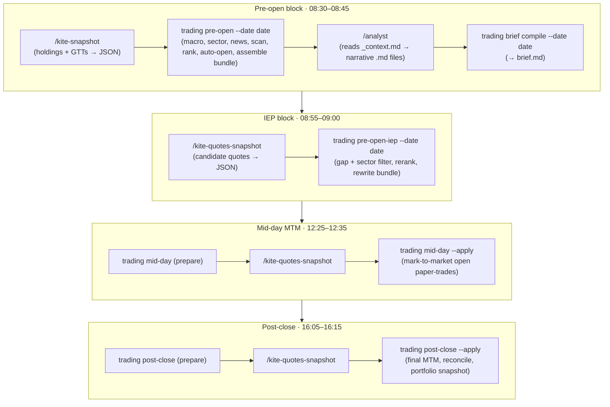

# 00 — System Overview

> Part of the [`docs/architecture/`](./PROGRESS.md) current-system design set.
> This file is the map; the numbered files that follow are the territory.

## 1. What this system is

A **single-operator, AI-assisted trading & portfolio-intelligence system for the
Indian equity market (NSE/BSE)**. It learns from daily market trends and plans
trades. It is currently in a **paper-trading** phase — it records simulated
trades and tracks their outcomes; it does **not** place real orders.

The system's job, every market day, is to answer three questions:

1. **What is the market regime today?** (risk-on / neutral / risk-off, from
   macro signals.)
2. **Which stocks are valid buy candidates?** (a rules gate, then an ML re-rank.)
3. **How are my existing holdings doing, and should anything be trimmed/exited?**

It produces a human-readable **daily brief** (assembled from data + an LLM
analyst pass) and an auto-maintained **paper-trade ledger**, then reconciles
predicted vs. actual outcomes over time.

### Two-layer decision model

The strategy is deliberately split so the cheap, explainable layer gates the
expensive, statistical one:

- **Layer A — Rule scanner** (`strategy/rules.py`): ten hard pass/fail filters
  (uptrend, pullback, RSI band, liquidity, no critical news, regime, F&O-ban,
  etc.). A stock must pass to be considered at all. This is fully transparent.
- **Layer B — LightGBM ranker** (`strategy/ranker.py`): scores the Layer-A
  survivors and selects the top-K. It is *advisory* and **cold-starts safely** —
  with no trained/active model, every rules-passing candidate is kept, so the
  system degrades to pure Layer A.

### Human-in-the-loop by design

The system is **reminder-driven**, not fully autonomous. Windows Task Scheduler
fires Slack/toast reminders at fixed IST times; the operator runs each command
manually in sequence. Two responsibilities are intentionally delegated to a
Claude Code LLM session via *skills*:

- **Kite data fetch** — the broker (Zerodha Kite) is read through MCP tools
  inside Claude Code (`/kite-snapshot`, `/kite-quotes-snapshot`), which write
  JSON files that the Python jobs consume. Python never holds the broker session.
- **The analyst narrative** — `/analyst` reads a machine-assembled context
  bundle and writes the prose brief (macro commentary, per-candidate cases).

This keeps secrets and live-account access in the interactive session, and uses
the LLM only for judgement/narrative, never for raw numeric computation.

## 2. The daily lifecycle at a glance

All times are IST. `<date>` is today's ISO date. Each block is a short sequence
of a Python command and (where broker data is needed) a Claude Code skill.



Cadence beyond the daily loop:

- **Weekly (Sunday)** — `trading weekly-train`: performance review +
  walk-forward LightGBM retrain with a soft-promotion gate.
- **Monthly (1st)** — `trading sip`: SIP allocation plan (top-up / new / cash).

The canonical command sequence with exact times lives in
[`docs/daily-workflow.md`](../daily-workflow.md); operational setup (Slack, Task
Scheduler import, troubleshooting) lives in [`docs/operations.md`](../operations.md).

## 3. Tech stack

| Concern | Choice |
|---|---|
| Language | Python `>=3.11,<3.12` (pinned — `ta` lacked reliable 3.12 wheels on Windows) |
| Package manager | `uv` |
| Lint / format | `ruff` (line length 100, broad rule set) |
| Type checking | `mypy --strict` on `src/trading` |
| Tests | `pytest` (markers: `live`, `integration`, `slow`); 56 test files |
| Data / numerics | `pandas`, `polars`, `pyarrow`, `numpy`, `ta` |
| Storage | SQLite (`data/app.db`) + Parquet (per-symbol OHLCV) |
| Sources | `kiteconnect` (fallback), `yfinance`, `nsepython`, `feedparser` |
| ML / sentiment | `lightgbm`, `scikit-learn`, `joblib`, `transformers` + `torch` (FinBERT) |
| Backtest | event-loop engine (custom, hand-rolled — no backtest library) |
| LLM | Claude Code skills (no LLM SDK — the production path uses skills, not API calls) |
| UI | `streamlit` + `plotly` |
| CLI / output | `typer`, `rich` |
| Ops | `loguru` (logging), `plyer` (Windows toast), Slack webhook |

> Note for reviewers: there are deliberately **no backtest or LLM-SDK packages**
> in the manifest — the backtester is a custom event loop (Phase 7 deviation) and
> the LLM is invoked via Claude Code skills (Phase 12 deviation, no API credits).
> The earlier `vectorbt`/`anthropic` placeholders were dropped per finding F-001
> so the dependency list isn't mistaken for the architecture.

## 4. Repository map

```
src/trading/
├── config.py            # Paths + Settings (frozen dataclasses); .env loading
├── cli.py               # Typer app — the entire operator command surface
├── data/                # Layer 1: ingestion (decoupled from analysis)
│   ├── yfinance.py      #   historical OHLCV fetch (parquet I/O is store/ohlcv.py)
│   ├── cache.py         #   requests-cache for HTTP fetchers
│   ├── kite.py          #   kiteconnect SDK wrapper (emergency fallback only)
│   ├── kite_snapshot.py #   reads broker JSON written by /kite-snapshot skill
│   ├── quotes_snapshot.py #  reads intraday quote JSON
│   ├── macro.py         #   global indices, USDINR, VIX, FII/DII
│   ├── news.py          #   RSS aggregator + NSE event calendar
│   ├── sector.py        #   11 NSE sectoral indices + relative strength
│   └── universe.py      #   symbol universe loader
├── features/            # Layer 2: analysis
│   ├── technicals.py    #   indicator suite (RSI, MACD, ATR, EMA, ADX, …)
│   ├── sentiment.py     #   FinBERT headline scoring
│   └── regime.py        #   4-axis macro regime voter
├── strategy/            # Layer 3: decision logic
│   ├── rules.py         #   Layer A — 10 hard filters
│   ├── sizing.py        #   position sizing (risk budget × regime × caps)
│   ├── exits.py         #   stop / target / time / trailing exit logic
│   ├── ranker*.py       #   Layer B — LightGBM (features, labels, train, io)
│   └── ranker.py        #   scoring + cold-start + backtest signal provider
├── backtest/            # costs, event-loop engine, walk-forward, metrics
├── portfolio/           # holdings health, GTT Monte-Carlo, SIP allocator
├── paper/               # paper-trade ledger, mark-to-market, reconciliation
├── llm/                 # context-bundle assembly + brief compilation
├── jobs/                # orchestrators: pre_open, pre_open_iep, mid_day,
│                        #   post_close, weekly_train, monthly_sip
├── store/               # SQLite (db, migrations, repos) + parquet + registry
├── ops/                 # runner/SCHEDULE, holiday calendar, logging, notify
└── ui/                  # Streamlit dashboard (Home + 3 pages)

data/                    # gitignored runtime data
├── app.db               # SQLite (all tabular state)
├── parquet/             # per-symbol OHLCV history
├── raw/<date>/          # broker JSON snapshots (holdings, gtts, quotes_HHMM)
├── research/<date>/     # context bundle + analyst .md + brief.md
├── cache/               # HTTP cache + FinBERT model cache
└── logs/                # rotating per-job loguru logs
models/                  # LightGBM pickles + registry.csv
.claude/skills/          # analyst, kite-snapshot, kite-quotes-snapshot, macro-doctor
docs/scheduler/          # Windows Task Scheduler XML (one per reminder slot)
```

## 5. CLI command surface

The Typer app (`trading …`) is the entire operator interface. Commands group by
purpose:

| Group | Commands |
|---|---|
| **Daily jobs** | `pre-open`, `pre-open-iep`, `mid-day`, `post-close` |
| **Periodic** | `weekly-train`, `sip` |
| **Brief** | `brief assemble-context`, `brief compile` |
| **Data ingest** | `ingest-history`, `ingest-news`, `macro snapshot`, `macro refresh`, `macro verify`, `sector` |
| **Analysis** | `scan`, `backtest` |
| **Portfolio / paper** | `portfolio`, `paper-open`, `paper-mtm`, `paper-status`, `paper-reconcile` |
| **Ranker (Layer B)** | `train-ranker`, `ranker-status` |
| **Broker fallback** | `kite-emergency-login`, `kite-emergency-snapshot` |
| **Ops** | `remind --slot <name>`, `notify-test` |

## 6. Core design principles

These recur in every layer; later docs assume them.

1. **Ingestion is decoupled from analysis.** `data/` fetchers know nothing about
   strategy; analysis runs against cached parquet/SQLite, so the whole pipeline
   works offline against historical data during development.
2. **Graceful degradation everywhere.** Every external source can fail
   independently without aborting the job: yfinance down → empty macro; Kite
   token absent → empty holdings; RSS down → no news. The job logs a warning and
   continues with reduced data, rather than crashing.
3. **Idempotent re-runs.** Jobs use SQLite UPSERTs and idempotent file writes
   plus guards (e.g. `_already_opened_today`), so re-running a job for the same
   date is safe and doesn't double-count.
4. **Pure functions for logic.** The decision cores — rules, sizing, exits,
   regime voting, health scoring, GTT simulation — are pure functions over
   dataclasses. This makes them unit-testable in isolation and is why the suite
   can be large and fast.
5. **Extension points over rewrites.** The backtest engine takes a
   `SignalProvider`, so the same engine runs the rules-only baseline *and* the
   Layer-B ranker without modification.
6. **Conservative simulation.** Fills happen next-day-open with slippage; on a
   same-bar stop/target tie the stop wins; costs use a Zerodha-accurate model.
   The paper P&L is intended to *under*-promise.
7. **Secrets stay in the interactive session.** Live broker access is mediated
   by Claude Code MCP skills writing JSON to disk; the batch Python never carries
   the broker session token in the production path.

## 7. How to read the rest of this set

- **[01-architecture](./01-architecture.md)** — how the modules depend on each
  other and the patterns that hold it together.
- **[02-data-schema](./02-data-schema.md)** — every table, file, and on-disk
  contract. Read this before the layer docs; they reference it.
- **03–08** — one layer per file, each explaining *what it does, how it works,
  and where it's fragile*.

---

## ⚠️ Robustness notes / open questions (system-wide)

Surfaced here at the overview level; each is expanded in its layer doc.

- **Single operator, manual sequencing.** The daily flow depends on a human
  running ~13 commands in order at the right times. A missed step (e.g. skipping
  IEP) silently leaves the bundle un-reranked. No orchestrator enforces ordering
  or detects a half-run day.
- **Broker data via LLM skill is a trust/consistency boundary.** The JSON
  contract between the `/kite-*` skills and `data/*_snapshot.py` is enforced only
  by the skill following its `SKILL.md`. A malformed write (wrong exchange,
  missing field) is caught only partially by readers. Worth a schema validator.
- **Dependency vs. reality drift.** ~~`vectorbt`/`anthropic` are installed but
  unused in production; conversely the real engine is custom.~~ Resolved by F-001:
  both placeholder deps were pruned and the manifest now carries a breadcrumb note
  for the custom-engine / skills deviations.
- **Paper-only, no execution path.** Nothing here places orders. The jump to
  Phase 19 (real money) is gated on ≥3 months OOS Sharpe > 1.0 and will need its
  own risk/kill-switch design — currently absent.
- **Time-zone correctness is load-bearing.** Everything keys off IST
  (`Asia/Kolkata`); date handling is centralised but every job re-derives "today"
  independently. A single canonical clock would reduce drift risk.
