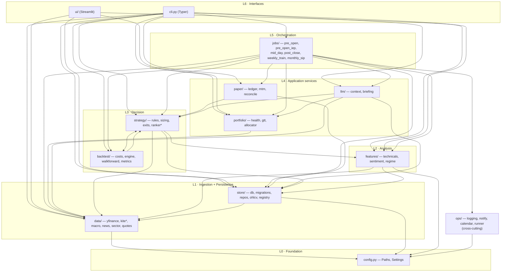
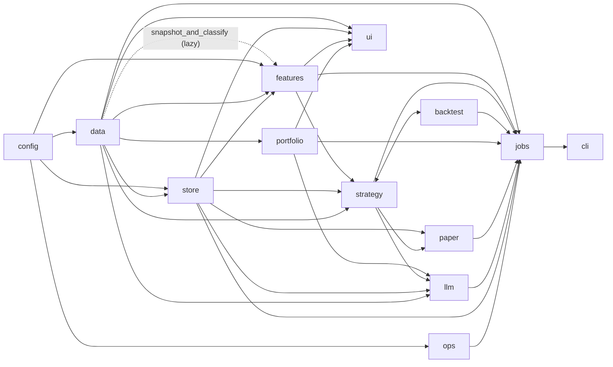

# 01 — Architecture

> Part of the [`docs/architecture/`](./PROGRESS.md) set. Read
> [00-overview](./00-overview.md) first. This file explains **how the modules
> depend on each other** and **the patterns that hold the system together**.
> Edges below were extracted from the actual `from trading.…` imports, not the
> specs.

## 1. Layered view

Conceptually the code stacks into layers; with two documented exceptions
(§3), dependencies point **downward** — higher layers import lower ones, never
the reverse.



### Layer responsibilities

| Layer | Packages | Responsibility | Depends on |
|---|---|---|---|
| L0 Foundation | `config` | Frozen `Paths` + `Settings`, `.env` loading | nothing |
| L1 Ingestion | `data` | Fetch from external sources → typed DTOs | `config` (+ `features.regime` back-edge, §3) |
| L1 Persistence | `store` | SQLite (db/migrations/repos) + parquet + model registry | `config`, `data` (for DTO types, §3) |
| L2 Analysis | `features` | Indicators, FinBERT sentiment, regime voting | `config`, `data`, `store` |
| L3 Decision | `strategy`, `backtest` | Rules, sizing, exits, ML ranker; cost-accurate backtester | each other (§3), `features`, `store`, `data` |
| L4 Services | `portfolio`, `paper`, `llm` | Holdings health/GTT/SIP; paper ledger/MTM; context+brief | `strategy`, `store`, `portfolio`, `data` |
| L5 Orchestration | `jobs` | Wire a whole block end-to-end with graceful degradation | nearly everything |
| L6 Interfaces | `cli`, `ui` | Operator command surface; dashboard | `jobs` + most layers |
| Cross-cutting | `ops` | Logging, Slack/toast notify, holiday calendar, reminder schedule | `config` |

## 2. Module-dependency graph (package level)

Same edges, collapsed to packages, so the shape is visible at a glance:



> `jobs` and `cli` import broadly by design — they are the composition roots.
> Everything else stays narrow.

## 3. Notable couplings & deliberate exceptions

These are the few places the clean layering bends. Each is intentional but
worth a reviewer's eye (the actionable ones are filed in
[FINDINGS.md](./FINDINGS.md)).

### 3.1 `store` → `data` for shared DTO types
The persistence layer imports domain dataclasses from the ingestion layer:
`store/ohlcv.py` ← `data.yfinance` (column constants), `store/macro_store.py` ←
`data.macro.MacroSnapshot`, `store/news_store.py` ← `data.news.NewsItem`,
`store/sector_store.py` ← `data.sector.SectorRow`. The row *shape* is owned by
`data`, and `store` persists that shape. This works, but it means "what a macro
snapshot is" lives in the fetcher, not in a neutral domain module — so `store`
(lower layer) depends on `data` (same layer, but logically its producer).
→ **F-006**.

### 3.2 `data.macro` → `features.regime` (the one upward back-edge)
`data/macro.py::snapshot_and_classify` fetches the macro snapshot *and* runs the
regime classifier, so it lazily imports `features.regime` (under
`TYPE_CHECKING` + inside the function). This is the single place ingestion
reaches up into analysis. It's convenient (one call returns a classified
snapshot) but it puts a decision concern in the data layer. → **F-007**.

### 3.3 `strategy` ⇄ `backtest` entanglement
These two are mutually dependent at the package level:
- `backtest.engine` imports `strategy.{rules, exits, sizing}` — the backtester
  *runs* the strategy.
- `strategy.ranker` / `ranker_train` / `ranker_labels` import
  `backtest.{engine, costs, metrics, walkforward}` — the ML layer *reuses* the
  backtest machinery to label training examples (replay Phase-6 exits) and to
  score OOS folds.

The cycle is real but broken at import time by `TYPE_CHECKING`/function-local
imports (e.g. `ranker.py` imports `BacktestConfig, Signal` only under
`TYPE_CHECKING`). It reflects a genuine truth — labels are *defined* by the
backtest's exit replay — but it makes the two packages hard to reason about
independently. → **F-008**.

### 3.4 Deferred / lazy imports as a tool
Lazy imports are used deliberately for two reasons, and a reviewer should know
which is which:

| Where | Reason |
|---|---|
| `cli.py` function-local imports of `ranker_*`, `weekly_train`, `monthly_sip` | **Startup cost** — avoid importing `lightgbm`/`torch` for unrelated commands |
| `data.macro` → `features.regime`, `ranker` → `backtest.engine`, `backtest.metrics` → `engine`, `portfolio.gtt` → `data.kite` | **Cycle / type-only** — needed only for annotations or to break §3.3 |

## 4. Cross-cutting patterns

The same handful of patterns recur in every layer; the layer docs (03–08)
assume them rather than re-explaining.

### 4.1 Graceful degradation via a `warnings` list
External-facing steps catch their own failures, append a human-readable string
to a `warnings: list[str]`, and return *partial* data instead of raising. The
job continues with reduced inputs. (Seen in every `data/*` fetcher and every
`jobs/*` orchestrator — e.g. `pre_open_iep` turns a missing quote snapshot into
`quotes = {}` plus a warning, then computes no gaps rather than crashing.) The
result dataclasses carry the `warnings` forward so the CLI can surface them.

### 4.2 Idempotent re-runs
Three mechanisms make re-running a job for the same date safe:
- **SQLite UPSERTs** — `INSERT … ON CONFLICT(…) DO UPDATE` in every `*_store`
  writer (macro, sector, news, signals), keyed on `(date[, symbol])`.
- **Guards** — e.g. `pre_open._already_opened_today` prevents duplicate
  paper-trades.
- **Atomic file writes** — JSON/markdown written to a `.tmp` then renamed, so a
  reader never sees a half-written file and a re-run overwrites cleanly.

### 4.3 Pure-function decision cores over frozen dataclasses
The logic that *decides* anything is a pure function taking a dataclass and
returning a dataclass — no IO, no globals:
`rules.passes_*` / `evaluate_symbol`, `sizing.position_size`, `exits.evaluate_exit`,
`regime.classify_regime`, `health` scorer, `gtt.simulate_target_hit`,
`allocator.allocate_sip`. This is why the test suite is large and fast (56 test
files) and why these cores can be reasoned about in isolation.

### 4.4 Frozen dataclass DTOs as the inter-layer contract
Data crosses layer boundaries as `@dataclass(frozen=True)` values, not dicts:
`Paths`, `Settings`, `Holding`, `Quote`, `GttOrder`, `Position`, `MacroSnapshot`,
`SectorRow`, `NewsItem`, `Candidate`, `Signal`, `SizingResult`, `ExitDecision`,
`HealthScore`, `ScoredCandidate`, … Immutability means a value can be passed
around without defensive copying.

### 4.5 The `SignalProvider` extension point
The backtester doesn't know *how* signals are chosen. It takes a callable:

```python
# backtest/engine.py
SignalProvider = Callable[
    [pd.Timestamp, Mapping[str, pd.DataFrame], ScanContext, BacktestConfig],
    list[Signal],
]
```

`run_backtest(..., signal_provider=None)` defaults to `rule_signal_provider`
(Layer A only). Phase 16 supplies `RankerSignalProvider` (`strategy/ranker.py`)
to run the *same engine* with Layer-B scoring. This single seam is what lets the
ranker be trained and evaluated against the exact fill/exit/cost model the live
system uses.

### 4.6 `Protocol`s for pluggable inputs
Where the set of implementations is open, the code uses `typing.Protocol`
instead of inheritance: `data.news.NewsSource` (RSS feed vs. NSE calendar vs.
test stub) and `backtest.metrics.TradeLike` (decouples metrics from the concrete
`Trade` and avoids a cycle with `engine`).

### 4.7 Two data planes
State lives in two places with a clear split (detailed in
[02-data-schema](./02-data-schema.md)):
- **SQLite (`data/app.db`)** — all *tabular, queryable* state (signals,
  paper_trades, snapshots, sentiment, …), reached only through `store` via a
  `get_conn()` context manager that enforces foreign keys.
- **Filesystem** — *bulk and document* state: per-symbol parquet OHLCV
  (`data/parquet/`), broker JSON snapshots (`data/raw/<date>/`), and the
  research bundle + analyst markdown (`data/research/<date>/`).

### 4.8 The prepare → (skill) → apply two-phase pattern
`mid_day` and `post_close` run in two passes around an interactive skill:
**prepare** writes `_quote_symbols.txt` and computes everything that doesn't need
live quotes; the operator runs `/kite-quotes-snapshot`; **apply** reads the fresh
quotes and commits MTM/reconcile. This is how a batch Python job cooperates with
an LLM-mediated broker fetch (see [00-overview §1](./00-overview.md)).

## 5. Composition roots

Two modules are *allowed* to import widely because their whole job is wiring:

- **`jobs/*`** — each orchestrator imports the services it sequences and owns the
  graceful-degradation + idempotency logic for one block. This is where the
  "what runs in what order" knowledge lives (Phase 7 doc).
- **`cli.py`** — the Typer app. Thin: it parses options, calls a job or a single
  module function, and renders a Rich table. Heavy/optional dependencies are
  imported inside the command body, not at module top, so `trading --help` stays
  fast.

`ui/` is a third, smaller composition root (Streamlit), but it reads only
through `ui/data.py`'s cached readers and never writes — it's a pure consumer.

---

## ⚠️ Robustness notes / open questions

- **Package-level cycle `strategy ⇄ backtest`.** Broken only by lazy imports.
  If someone adds a module-top import across that seam, it'll surface as an
  import error at a distance. A clearer split (e.g. a small `labeling` module
  that both depend on) would remove the footgun. → F-008.
- **Domain types live in `data`, not a neutral module.** Makes `store` depend
  "up" into the fetchers and couples persistence to ingestion shape. A
  `trading/domain` (or `types`) module holding the DTOs would let both `data`
  and `store` depend on it instead. → F-006.
- **A decision concern (regime) lives in `data.macro`.** `snapshot_and_classify`
  is convenient but mislayered; moving classification into `features`/a job would
  keep `data` purely about fetching. → F-007.
- **Graceful degradation can mask real outages.** Because every source failure
  becomes a warning + empty data, a day where (say) macro silently returned empty
  still produces a "successful" bundle. The `warnings` are surfaced but nothing
  *fails* the run or alerts on repeated degradation. Ties to F-003 (half-run /
  health detection).
- **No dependency lint.** Nothing enforces the layering (e.g. import-linter), so
  the documented direction is a convention, not a guarantee. → F-009.
