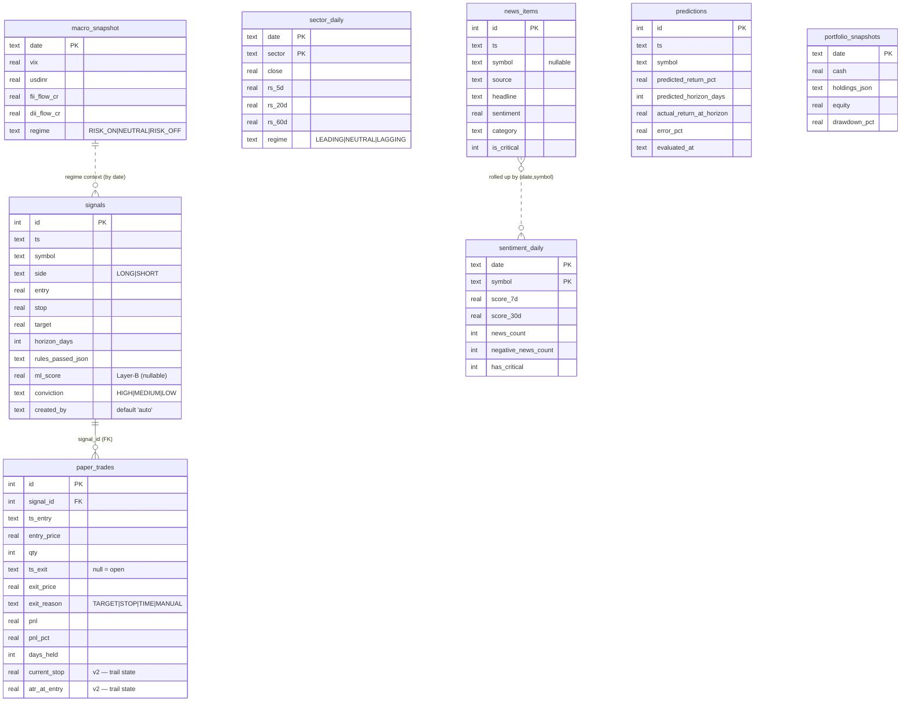

# 02 — Data Schema & On-Disk Contracts

> Part of the [`docs/architecture/`](./PROGRESS.md) set. The layer docs (03–08)
> reference this file for "where does X live and what shape is it." Grounded in
> `store/migrations.py`, `store/ohlcv.py`, `store/model_registry.py`, and the
> snapshot reader/skill contracts.

## 1. The two data planes

State splits cleanly (see [01 §4.7](./01-architecture.md)):

| Plane | Location | Holds | Accessed via |
|---|---|---|---|
| **SQLite** | `data/app.db` | tabular, queryable state | `store/` (only) |
| **Parquet** | `data/parquet/nifty200/<SYMBOL>.parquet` | per-symbol OHLCV history | `store/ohlcv.py` |
| **Broker JSON** | `data/raw/<date>/*.json` | holdings, GTTs, positions, intraday quotes | `data/kite_snapshot.py`, `data/quotes_snapshot.py` |
| **Research docs** | `data/research/<date>/*.md` | context bundle + analyst narrative + brief | `llm/` |
| **Models** | `models/*.pkl` + `models/registry.csv` | LightGBM pickles + training-run registry | `store/model_registry.py` |

All of `data/` and `models/*.pkl` are gitignored runtime state.

## 2. SQLite access & migrations

- **Connection** — `store/db.py::get_conn()` is a context manager that opens
  `data/app.db`, sets `PRAGMA foreign_keys = ON`, and uses
  `row_factory = sqlite3.Row` (so callers index columns by name).
- **Migrations** — `store/migrations.py::run_migrations(conn)` is idempotent and
  version-stamped. `schema_version` records each applied version with a UTC
  timestamp. Current version is **4**:
  - **v1** — all 16 domain tables.
  - **v2** — adds `current_stop` + `atr_at_entry` to `paper_trades` so the
    trailing stop ratchets across daily MTM runs without re-deriving from
    history. Both nullable for legacy rows.
  - **v3** (F-016) — collapses any pre-existing duplicate `news_items` rows, then
    adds the `idx_news_dedup` UNIQUE index on `(source, headline, COALESCE(url,''))`
    so daily re-fetch (with `INSERT OR IGNORE`) is idempotent at the DB level.
  - **v4** (F-035) — adds the `macro_reconciliation` side table (PK
    `(date, field)`) carrying the cross-source audit trail for macro figures:
    primary/secondary value + source, `abs_delta`, and a `status` flag
    (`ok`/`mismatch`/`missing_primary`/`missing_secondary`/`unreconciled`). Kept
    off `macro_snapshot` so that table stays a clean one-row-per-day fact.
- **Upgrade path** — future changes add a `SCHEMA_V5` constant + a `if current
  < 5:` branch. Migrations only ever move forward; there is no down-migration.

## 3. Entity-relationship view (active tables)

Only **one** real foreign key exists (`paper_trades.signal_id → signals.id`).
Everything else relates *logically* by `date`/`symbol`, joined in queries rather
than enforced by constraints.



## 4. Table catalog

### 4.1 Active tables (written by the system)

These 8 tables have live writers and drive the daily flow.

| Table | PK | Written by | Purpose |
|---|---|---|---|
| `signals` | `id` auto | `paper.ledger` / `pre_open` | One row per emitted trade idea: entry/stop/target, `rules_passed_json`, optional `ml_score` + `conviction`. `created_by` distinguishes `auto` vs manual. |
| `paper_trades` | `id` auto | `paper.ledger` / `paper.mtm` | The simulated position lifecycle. Opens with `ts_exit=NULL`; MTM fills `exit_*`, `pnl*`, `days_held`. v2 columns hold trailing-stop state. FK → `signals`. |
| `predictions` | `id` auto | `paper.reconcile` (+ ledger) | Predicted return vs. realised at horizon; `error_pct` filled at `evaluated_at`. Feeds the calibration view. |
| `portfolio_snapshots` | `date` | `post_close` / `reconcile` | Daily equity mark: `cash`, `holdings_json` (serialised holdings), `equity`, `drawdown_pct`. Drives the equity curve. |
| `news_items` | `id` auto | `data.news` → `store.news_store` | Raw headlines: `source`, `headline`, `url`, FinBERT `sentiment`, `category`, `is_critical`. `symbol` nullable (market-wide news). |
| `sentiment_daily` | `(date,symbol)` | `features.sentiment` | Per-symbol rollup: 7d/30d mean score, counts, `has_critical`. UPSERT. The strategy reads this, not raw `news_items`. |
| `sector_daily` | `(date,sector)` | `data.sector` → `store.sector_store` | Per-sector close + relative strength (5/20/60d) + LEADING/NEUTRAL/LAGGING regime. UPSERT. |
| `macro_snapshot` | `date` | `data.macro` → `store.macro_store` | Daily macro row + classified `regime`. The schema has 11 macro columns; §4.3 notes which are actually populated. UPSERT. |
| `macro_reconciliation` | `(date,field)` | `cli macro refresh` → `store.reconciliation_store` (F-035; F-036 verify) | Cross-source audit trail per macro field: primary/secondary value + source, `abs_delta`, `status`. v4 table. UPSERT. |

### 4.2 Reserved tables (defined in v1) and the one now live (F-010)

`fno_ban_list` is **now written** daily by `pre_open._step_fno_ban` (NSE
`fo_secban.csv`) and read by `build_scan_context` into `ScanContext`, reviving
the `passes_not_fno_banned` veto (was dead per F-019). The other 7 tables remain
**schema reservations** — a reviewer should treat them as reserved, not live
data. → **F-010**.

| Table | Status | Rationale / revisit trigger |
|---|---|---|
| `fno_ban_list` | **LIVE** | Written by `_step_fno_ban`; feeds `passes_not_fno_banned` |
| `oi_daily` | Reserved | No clean OI-history feed; for an options-flow strategy |
| `bulk_block_deals` | Reserved | Informational, no consumer; for a smart-money signal |
| `corp_actions` | Reserved | yfinance serves adjusted OHLCV; for raw-price storage |
| `account_events` | Reserved | Audit log for the real-money path (F-005, suspended) |
| `preopen_snapshot` | Reserved | IEP persists to `raw/<date>` JSON |
| `live_quotes` | Reserved | Intraday quotes persist to `quotes_HHMM.json` |
| `event_calendar` | Reserved | NSE events land in `news_items` + `sentiment_daily` |

The critical-event veto (`passes_no_critical_event`) is served by
`sentiment_daily` (F-019), so `event_calendar` stays reserved without leaving a
gate dead. `t2t_symbols` has no table and still awaits an NSE T2T feed. → **F-011**.

### 4.3 Field-level notes worth flagging

- **`macro_snapshot` has 11 source columns** (`sgx_nifty`, `dow_fut`,
  `nasdaq_fut`, `sp500`, `usdinr`, `crude`, `vix`, `us_10y`, `fii_flow_cr`,
  `dii_flow_cr`) but the regime voter uses a subset (VIX, global futures mean,
  FII flow, USDINR). Some columns may be persisted `NULL`. Confirmed against the
  fetcher in [03-data-layer](./03-data-layer.md).
  - **Naming caveat (F-017):** `dow_fut`/`nasdaq_fut` are misnomers — they store
    SPOT index closes (`^DJI`/`^IXIC`), **not** index futures. The names are kept
    for schema/data stability; the values serve as overnight global-direction
    proxies and the regime voter reads the underlying quote dict, not these
    columns, so the misnomer is cosmetic. `sgx_nifty` is reserved and always
    `NULL` (no reliable free GIFT/SGX-Nifty ticker since the 2023 SGX->IFSC move).
- **`signals.rules_passed_json`** stores the Layer-A pass/fail map as JSON text —
  denormalised on purpose so a signal is self-describing without a join.
- **CHECK constraints** encode the enums (sides, exit reasons, regimes, impact
  levels). These are the schema's only validation; numeric ranges are not
  constrained.

## 5. Parquet OHLCV layout

```
data/parquet/nifty200/<SYMBOL>.parquet     # symbol suffix-stripped: RELIANCE.NS → RELIANCE.parquet
```

- Columns are **exactly** `(open, high, low, close, volume)` — `store/ohlcv.py`
  rejects any other column set on write (`REQUIRED_COLUMNS`). Index is the date.
- `parquet_path()` strips the yfinance `.NS` suffix so the on-disk name is the
  bare ticker. `list_symbols()` enumerates the directory.
- The subdir is hardcoded `nifty200` even though the active universe is the
  Nifty 50 (+ 8 holdings, ≈ 58 ingested). The candidate scope was pinned to the
  Nifty 50 on 2026-06-16 (**F-012 ✅ Fixed**); the `nifty200/` directory rename
  itself is deferred (cosmetic, touches `store/ohlcv.py` + tests).
- Storage-boundary cleaning: `_drop_trailing_nan_close` strips yfinance's
  current-day NaN-OHLC stub (Phase 12.5 fix) so indicators don't see a phantom
  bar.

## 6. Broker & quote JSON contracts (`data/raw/<date>/`)

Written by Claude Code skills, read by `data/*_snapshot.py`. The field names
match the dataclasses in `data/kite.py`. **✅ Validated at the read boundary
(F-002, 2026-06-17):** `snapshot_schema.validate_rows` checks each row against
its dataclass (type/exchange/missing/extra/null) and raises `SnapshotSchemaError`
with a remediation, rather than splatting `Holding(**row)` unchecked.

| File | Writer (skill) | Reader | Shape |
|---|---|---|---|
| `holdings.json` | `/kite-snapshot` | `kite_snapshot.read_holdings` | list of `Holding` rows (tradingsymbol, exchange, isin, quantity, average_price, last_price, close_price, pnl, day_change, day_change_percentage) |
| `gtts.json` | `/kite-snapshot` | `kite_snapshot.read_gtts` | list of `GttOrder` rows (id, type, status, tradingsymbol, exchange, trigger_values[], last_price, created_at, orders[]) |
| `positions.json` | `/kite-snapshot` (optional) | `kite_snapshot.read_positions` | list of `Position` rows |
| `_meta.json` | both skills | snapshot readers | `{snapshot_at, source: "mcp"|"sdk-fallback", skill_version, quotes_at}` — readers validate the date matches `<date>` |
| `_quote_symbols.txt` | `trading mid-day`/`post-close` (prepare) | `/kite-quotes-snapshot` | one ticker per line; the symbol list to quote |
| `quotes_HHMM.json` | `/kite-quotes-snapshot` | `quotes_snapshot.read_latest_quotes` | list of `Quote` rows; **HHMM in the filename is the capture time** and the staleness source of truth |

Staleness: `read_latest_quotes` picks the newest `quotes_HHMM.json` and checks
its HHMM against wall-clock; too old → `QuoteSnapshotStaleError`. Missing →
`QuoteSnapshotMissingError`. Date mismatch in `_meta.json` →
`KiteSnapshotStaleError`.

## 7. Research bundle (`data/research/<date>/`)

The document plane for one trading day. Written across the pre_open → analyst →
compile flow (and mid/post-close).

| File | Written by | Contents |
|---|---|---|
| `_context.md` | `llm.context.assemble_context` | Machine-assembled bundle: macro, sector momentum, candidates, holdings health, open trades. Input to `/analyst` and `pre_open_iep` (which rewrites it). |
| `macro_brief.md` | `/analyst` | Regime narrative |
| `sector_commentary.md` | `/analyst` (optional) | Per-sector commentary |
| `candidates/<SYMBOL>.md` | `/analyst` | Per-candidate bull/bear case + conviction |
| `mid_day_update.md` | `mid_day --apply` | Intraday MTM update |
| `post_close_summary.md` | `post_close --apply` | EOD summary |
| `post_close_recap.md` | `/analyst` (post_close mode) | Day recap + prediction-error analysis |
| `brief.md` | `brief compile` | The compiled human brief (fixed-order concatenation) |

## 8. Model registry (`models/`)

- **Pickles** — `models/ranker_<train_end>.pkl` via joblib, holding `(model,
  feature_names)` together so inference can detect a feature mismatch.
- **`registry.csv`** — one row per training run; columns:
  `version, trained_at, train_start, train_end, oos_sharpe, oos_hit_rate,
  n_train_examples, n_features, path, active, notes`.
- **Invariant** — at most **one** row may have `active=true`; the loader raises
  if it finds more. Promotion is gated by a 0.05 walk-forward Sharpe deadband
  (Phase 16), so a new model only goes active if it beats the current active OOS
  Sharpe by > 0.05 (NaN never promotes). Detailed in
  [04-analysis-strategy](./04-analysis-strategy.md).

---

## ⚠️ Robustness notes / open questions

- **Most reserved tables remain dormant by design.** Of the 8 once-writerless
  domain tables, `fno_ban_list` is now live (F-010) — reviving the
  `passes_not_fno_banned` gate; the other 7 are explicitly annotated as reserved
  in the migration + §4.2 (rationale + revisit trigger each). → F-010 (resolved),
  F-011.
- **Only one enforced FK.** Cross-table integrity (e.g. a `prediction` or
  `sentiment_daily` row referencing a real symbol/date) is by convention. A bad
  `date` string can't be caught by the DB. Consider a symbol/date dimension or
  app-level validation.
- **Broker/quote JSON contracts** are now validated at the read boundary
  (✅ F-002), but the `holdings_json` / `rules_passed_json` blobs inside SQLite
  remain opaque to queries — schema changes to those blobs are invisible to
  migrations.
- **`nifty200` subdir name overstates the universe** (≈58 ingested symbols).
  Candidate scope pinned to the Nifty 50 (F-012 ✅ Fixed 2026-06-16); the
  directory rename is a deferred cosmetic follow-up.
- **No retention/compaction policy** for `news_items` (append-only, one row per
  headline per day) or `data/raw/<date>/` JSON. Over months this grows unbounded.
  → F-013.
