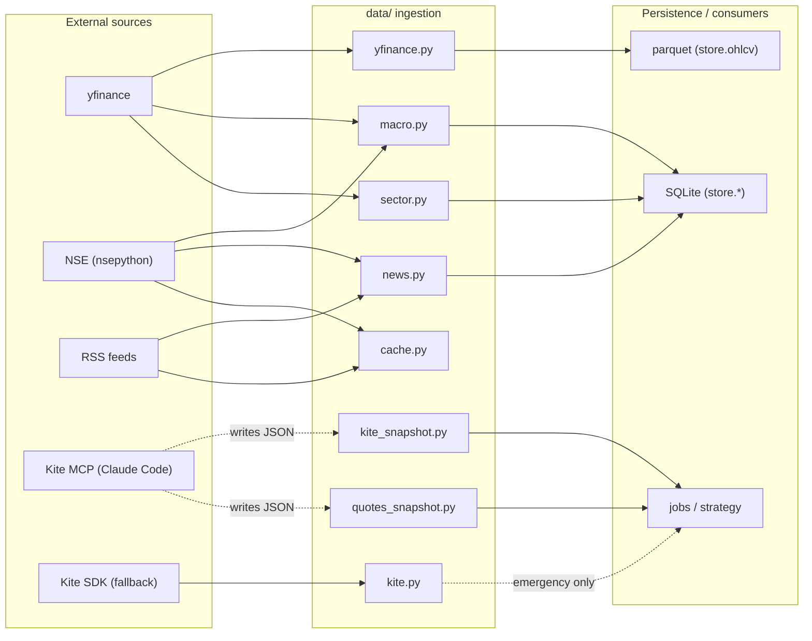

# 03 — Data Layer (`data/`)

> Part of the [`docs/architecture/`](./PROGRESS.md) set. Covers the **ingestion
> layer**: every external source, how it's normalised into frozen DTOs, and how
> each one fails. Grounded in `src/trading/data/*.py`. Storage of what these
> fetch is in [02-data-schema](./02-data-schema.md).

## 1. Role & shape

`data/` is the only layer that talks to the outside world. Its contract to the
rest of the system:

- **In:** external sources (yfinance, NSE via nsepython, RSS, Kite via MCP/SDK).
- **Out:** frozen dataclasses (`Holding`, `Quote`, `MacroSnapshot`, `SectorRow`,
  `NewsItem`, …) — never raw dicts or live HTTP responses.
- **Failure mode:** best-effort. A failing source returns `None`/`[]`/partial
  rather than raising, so the caller degrades (the one exception that *does*
  raise is OHLCV fetch — `OhlcvFetchError` — because an empty price history is
  unusable, not degraded).

## 2. Module map

| Module | Source | Output DTO | Failure |
|---|---|---|---|
| `yfinance.py` | yfinance | OHLCV `DataFrame` | raises `OhlcvFetchError` |
| `cache.py` | — | `CachedSession` (SQLite, 1h TTL) | n/a |
| `kite.py` | Kite SDK | `Holding`/`Position`/`GttOrder`/`Quote`/`Margin` | `KiteAuthError` on token expiry |
| `kite_snapshot.py` | JSON (from `/kite-snapshot`) | `Holding`/`GttOrder`/`Position` | `KiteSnapshotMissing`/`StaleError` |
| `quotes_snapshot.py` | JSON (from `/kite-quotes-snapshot`) | `dict[symbol, Quote]` | `QuoteSnapshotMissing`/`StaleError` |
| `macro.py` | yfinance + NSE | `MacroSnapshot`, `YfQuote` | per-source `None` |
| `news.py` | RSS + NSE events | `NewsItem` | per-source isolation (skip) |
| `sector.py` | yfinance | `SectorRow` | per-ticker skip |
| `universe.py` | `data/static/universe.txt` | `list[str]` | reads file |

## 3. Per-module logic

### 3.1 `yfinance.py` — historical OHLCV
`fetch_ohlcv(symbol, start, end, auto_adjust=True)` hides yfinance's
irregularities: it flattens MultiIndex columns, lowercases names, enforces the
exact `(open, high, low, close, volume)` set, and strips tz to a naive
`DatetimeIndex(name="date")`. `to_yf_symbol` appends the `.NS` NSE suffix
idempotently. Adjusted prices are the default (`auto_adjust=True`), so splits/
dividends are already baked in — which is why the dormant `corp_actions` table
isn't needed for price adjustment.

**Freshness (✅ F-018 fixed 2026-06-16):** `store.ohlcv.read_ohlcv` applies
`_drop_trailing_nan_close` (Phase 12.5 — strips yfinance's current-day NaN stub
bar). `pre_open` now runs `data/ohlcv_refresh.py::refresh_ohlcv` (incremental
tail pull) before the scan, and `strategy/rules.py::scan` enforces a
`MAX_BAR_AGE_DAYS = 5` staleness guard — symbols whose last bar is older are
skipped with a warning instead of silently scanning stale prices. Manual
`trading refresh-ohlcv` is also available. → **F-018**.

### 3.2 `cache.py` — HTTP cache
`get_cached_session()` returns a `requests_cache.CachedSession` backed by
`data/cache/http.sqlite` with a 1-hour TTL. Used by the RSS fetchers so repeated
runs in a session don't re-hit feeds. (yfinance and nsepython manage their own
HTTP, so the cache covers news only.)

### 3.3 `kite.py` — SDK wrapper (emergency fallback only)
A typed wrapper over `kiteconnect`. Each call returns a frozen dataclass; the
adapters (`_to_holding`, `_to_quote`, …) defensively coerce types and tolerate
missing optional fields. `TokenException` is translated to `KiteAuthError` so
callers branch on "re-login required" without importing SDK internals. **Post
Phase 13.5 this is wired only into the `kite-emergency-*` CLI commands** — the
production path reads JSON snapshots instead (§3.4). `_to_quote` derives `bid`/
`ask` from the top of the depth ladder.

### 3.4 `kite_snapshot.py` — the production broker reader (MCP pivot)
Readers for the JSON that the `/kite-snapshot` skill writes. `read_holdings`/
`read_gtts`/`read_positions` open `data/raw/<as_of>/<resource>.json` and splat
each row into the `data.kite` dataclass (`Holding(**row)`). `_validate_meta`
checks that `_meta.json`'s `snapshot_at` date-prefix equals `as_of`, else
`KiteSnapshotStaleError`; a missing file raises `KiteSnapshotMissingError` with a
"run /kite-snapshot" remediation.

> **Validation gap:** `Holding(**row)` is the *only* structural check — an extra
> key raises a raw `TypeError`, a missing key a `TypeError`, and a wrong-typed
> value is silently accepted (no coercion, unlike the SDK adapters). The skill
> is responsible for emitting exactly the dataclass fields. → F-002.

### 3.5 `quotes_snapshot.py` — intraday quotes reader
`read_latest_quotes(paths, as_of, max_age_minutes=30)` scans the date dir for
`quotes_HHMM.json`, picks the newest by `HHMM`, and rebuilds a
`dict[symbol, Quote]` (popping `tradingsymbol` before `Quote(**row)`). **The
filename HHMM is the single source of truth for capture time**; staleness is
`datetime.now() - capture_ts > max_age_minutes`. A tightened regex rejects
invalid hours/minutes.

> `datetime.now()` is **naive local time** and `capture_ts` is built from
> `as_of` + HHMM — both assume the host clock is IST. Correct on the intended
> machine, fragile anywhere else. Ties to F-004 (no canonical clock). → F-018.

### 3.6 `macro.py` — macro snapshot + regime trigger
- **yfinance tickers** (`YF_TICKERS`): `^GSPC`/`^IXIC`/`^DJI` (US spot indices),
  `INR=X` (USDINR), `BZ=F` (Brent), `^INDIAVIX` (India VIX), `^TNX` (US 10y).
  `fetch_yf_quote` returns latest close + 1-day % change, pulling
  `lookback_days=10` bars so weekends/holidays don't empty the window.
- **FII/DII** (`fetch_fii_dii`): wraps `nsepython.nse_fiidii`, tolerant of both
  modern (`category`/`netValue`) and legacy (`type`/`netVal`) schemas; any
  failure → `(None, None)`.
- **`build_snapshot`** assembles a `MacroSnapshot` (regime left `None`).
- **`snapshot_and_classify`** is the end-to-end call: fetch once → build snapshot
  → run the regime classifier → return a snapshot with `regime` filled. This is
  the documented **upward back-edge** into `features.regime` (F-007).

> Column-naming mismatch: the schema's `dow_fut`/`nasdaq_fut` columns actually
> store **spot** index closes (`^DJI`/`^IXIC`), not futures, and `sgx_nifty` is
> always `None` (no reliable ticker post SGX→IFSC). Harmless to logic (regime
> uses the values regardless of name) but misleading. → F-017.

### 3.7 `news.py` — RSS + NSE events + symbol attribution
- **Sources** behind a `NewsSource` Protocol: three RSS feeds (Moneycontrol, ET,
  Business Standard) via the cached session, plus `NseEventsSource`
  (corporate-event calendar via `nsepython.nse_events`). `default_sources()`
  bundles them.
- **`fetch_all_news`** pulls every source with **per-source isolation** (a
  raising adapter contributes nothing, doesn't abort), **dedups by URL**, and
  attributes a symbol via `attribute_symbol` (whole-word, case-insensitive match
  against the alias map). Unmatched → `symbol=None` (still useful for
  macro/sector narrative).
- **Alias map** comes from `default_aliases()` → the maintained
  `data/static/aliases.csv` (`load_aliases_map`), falling back to the built-in
  `DEFAULT_ALIASES` only on a fresh checkout without the CSV. The same map's keys
  drive the sentiment-rollup watch-list in `pre_open._step_news` / `cli news-pull`.

> One real gap remains here for the Nifty-50 goal:
> - **✅ Alias coverage fixed (F-015, 2026-06-17).** `data/static/aliases.csv`
>   now covers the full ingest universe — all 50 Nifty constituents + 8 holdings
>   (58 symbols, `|`-separated company-name variants, ambiguous bare tokens
>   avoided, `SBILIFE` ordered ahead of `SBIN`). Attribution + the rollup
>   watch-list both read it, so `sentiment_daily` is no longer starved to 12 names.
> - **Dedup is URL-only and within a single run.** NSE events re-fetched each day
>   (and re-pulled headlines) create duplicate `news_items` rows across runs —
>   there's no DB-level uniqueness on `url`/`headline`. → **F-016**.

### 3.8 `sector.py` — sectoral relative strength
- **11 NSE sector indices** (`SECTOR_TICKERS`) benchmarked against `^NSEI`
  (Nifty 50). `compute_rs` is simple-difference RS (`sector_ret_N −
  bench_ret_N`) over 5/20/60-day windows; `None` when history is short or the
  lookback close is zero.
- **`_regime_for(rs_20d)`** labels LEADING/NEUTRAL/LAGGING at ±2%.
- **`fetch_all_sectors`** returns no row for a failed sector ticker, and an empty
  list if the *benchmark* fails (RS undefined without it). All rows are stamped
  with `as_of` even if yfinance's last bar lags a day.
- **`load_sector_map`** reads `data/static/sector_map.csv` (`symbol,sector`),
  tolerating comments/blanks, returning `{}` if absent (callers degrade).

### 3.9 `universe.py` — symbol list
`load_universe()` reads `data/static/universe.txt` (one ticker per line,
comments/blanks skipped, dedup preserving order). This is the *intended* trading
universe — but see the coverage gap below.

## 4. The coverage reality (resolved 2026-06-16)

> **Update (2026-06-16):** the coverage gap below has been **fixed** (F-014 +
> F-012). All 50 Nifty constituents plus 8 non-Nifty holdings are now ingested,
> the candidate set is pinned to the Nifty 50 (`data/static/nifty50.txt`), and
> `pre-open` now reports `candidates_total = 50`. The historical table is kept
> for context.

Originally the configured universe and what was actually ingested diverged
sharply:

| Source of truth | Count (pre-fix) | Now |
|---|---|---|
| `data/static/nifty50.txt` (candidate set) | — | **50** |
| `data/static/universe.txt` (ingest set) | 60 | 58 |
| `data/static/sector_map.csv` | 57 | 59 |
| **Parquet OHLCV actually on disk** (`data/parquet/nifty200/`) | **12** | **58** |

Previously the scanner iterated `store.ohlcv.list_symbols()` (the parquet
directory), so the live candidate universe was just 12 stocks. The scan now
drives off `load_candidate_universe()` (the pinned Nifty 50), and every Nifty-50
symbol has history — so `pre-open` evaluates all 50. → **F-014 / F-012** (both
✅ Fixed). The `nifty200/` subdir name is now a cosmetic misnomer (rename
deferred).

## 5. MCP-vs-SDK split (recap)

Two ways to reach Kite, deliberately separated:

| Path | Module | When |
|---|---|---|
| **MCP via skill** (production) | `kite_snapshot`, `quotes_snapshot` | normal daily flow — Claude Code holds the session, writes JSON |
| **SDK direct** (fallback) | `kite.py` | only `kite-emergency-login` / `kite-emergency-snapshot` CLI |

This keeps the broker session and secrets in the interactive Claude Code
session; the batch Python reads files. See [00-overview §1](./00-overview.md).

---

## ⚠️ Robustness notes / open questions

- **✅ (Fixed 2026-06-16) The system was effectively trading 12 stocks.**
  Universe config said ~57–60 and the requirement is Nifty 50, but only 12
  symbols had parquet history, so scan/rank/auto-open all operated on 12. Now
  resolved: all 50 Nifty constituents are ingested and the candidate set is
  pinned to the Nifty 50, so `pre-open` evaluates 50. → F-014 / F-012.
- **✅ (Fixed 2026-06-16) OHLCV is never auto-refreshed.** `pre_open` now runs
  `refresh_ohlcv` (incremental tail pull) before the scan, the scanner skips
  bars older than `MAX_BAR_AGE_DAYS` (5) with a warning, and a Kite close
  cross-check flags >0.5% divergence on holdings. Manual `trading refresh-ohlcv`
  also available. → F-018.
- **✅ (Fixed 2026-06-17) Sentiment attribution covered only 12 symbols.**
  `data/static/aliases.csv` now spans the full 58-symbol ingest universe, so the
  critical-news veto (F-019) and per-symbol sentiment features get real coverage
  across candidates + holdings. → F-015.
- **News table grows with duplicates.** URL-only, single-run dedup + daily event
  re-fetch ⇒ duplicate rows accumulate. → F-016 (and F-013 retention).
- **Snapshot readers trust the skill.** Structural validation is just
  `Dataclass(**row)`; no schema/type enforcement at the boundary. → F-002.
- **Naive local clock** in quote staleness assumes host == IST. → F-004/F-018.
- **Macro column labels lie** (`*_fut` hold spot; `sgx_nifty` always None). → F-017.
