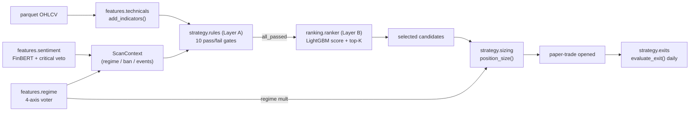
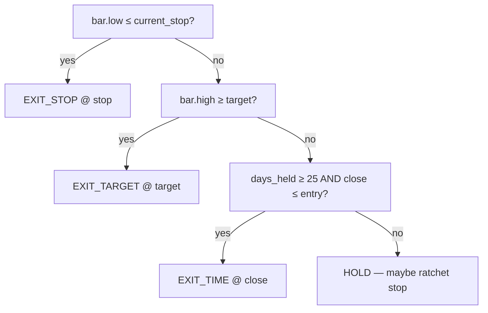

# 04 — Analysis & Strategy (`features/`, `strategy/`)

> Part of the [`docs/architecture/`](./PROGRESS.md) set. This is the analytical
> core: how raw bars become indicators (`features/`) and how indicators + context
> become trade decisions (`strategy/`). Grounded in the source. **This phase
> resolves the F-011 question** (§3.4) and surfaces the most important
> correctness finding in the review so far.

## 1. The pipeline



The key structural point: **Layer A is a hard gate, Layer B re-ranks the
survivors, sizing/exits manage the position.** Sentiment and regime are *meant*
to feed both the gate (`ScanContext`) and sizing — §3.4 shows where that wiring
is currently missing.

## 2. `features/` — analysis

### 2.1 `technicals.py` — indicator suite
Thin wrappers over the `ta` library; every function returns a `pd.Series`, no
mutation. `add_indicators(df)` returns an enriched copy with the default suite
that Layer A consumes:

| Indicator | Columns added | Default params |
|---|---|---|
| RSI | `rsi_14` | 14 |
| SMA | `sma_20`, `sma_50`, `sma_200` | 20/50/200 |
| EMA | `ema_20`, `ema_50` | 20/50 |
| MACD | line / signal / hist | 12/26/9 |
| Bollinger | upper/mid/lower | 20, 2σ |
| ATR | `atr_14` | 14 |
| ADX | `adx_14` | 14 |
| VWAP | `vwap_14` | 14 |
| OBV | `obv` | — |
| returns | daily return | — |

NaN warm-up is preserved (`fillna=False`) — the first 199 rows have no `sma_200`,
which is why the scanner needs `MIN_HISTORY_BARS = 200`.

### 2.2 `sentiment.py` — FinBERT + critical veto
Three things per headline:
- **Score** — FinBERT (`ProsusAI/finbert`, lazy singleton, ~440 MB CPU) →
  `score = P(positive) − P(negative) ∈ [-1, +1]`. Empty text → 0.
- **Category** — first-match keyword bucket (results / management / regulatory /
  M&A / downgrade / dividend / pledge). Low-precision by design — the ranker only
  uses counts, not the category itself.
- **`is_critical`** — a regex set (`CRITICAL_PATTERNS`: SEBI bar/probe, auditor
  resign, fraud, going-concern, promoter pledge, default, NCLT, ED/CBI raid, …)
  intended as a **hard veto**.

**Aggregation:** `aggregate_symbol` rolls trailing 7d/30d mean score, `news_count`,
`negative_news_count` (≤ −0.20), and `has_critical` into a `sentiment_daily` row
(UPSERT). Symbols with zero news in 30d are skipped (no empty rows).

> The critical veto is computed (`has_critical`, `is_critical`) **and now
> enforced** — `build_scan_context` feeds `has_critical` into the scan's
> `critical_event_symbols`, so the gate fires (✅ F-019, 2026-06-16). See §3.4.

### 2.3 `regime.py` — 4-axis macro voter
A pure classifier over four axes, each voting −1/0/+1:

| Axis | +1 | −1 | Source |
|---|---|---|---|
| India VIX | < 14 (calm) | > 20 (fear) | macro `vix` close |
| Global futures | mean Δ ≥ +0.30% | ≤ −0.30% | S&P/Nasdaq/Dow 1d% |
| FII flow | ≥ +₹2000 cr | ≤ −₹2000 cr | NSE FII net |
| USDINR | ≤ −0.50% (₹ strong) | ≥ +0.50% (₹ weak) | USDINR 1d% |

`composite_score ∈ [−4, +4]`: ≥ +2 → **RISK_ON**, ≤ −2 → **RISK_OFF**, else
**NEUTRAL**. A missing reading votes 0 (neutral). The result carries per-axis
votes + reasons (the brief renders them). `position_size_multiplier` maps
RISK_ON/NEUTRAL/RISK_OFF → 1.0 / 0.75 / 0.5.

> **Two distinct concepts, now distinctly named** (F-020, fixed): this 4-axis
> voter is the **`regime`** classifier (feeds *sizing*). The Layer-A gate that
> uses VIX ≥ 25 OR Nifty-200 5d drawdown ≤ −5% — a different, extreme-stress
> *hard veto* with different thresholds/inputs — was renamed **`passes_market_filter`**
> (rule name `market_filter`) so the two no longer collide. They are kept
> separate on purpose: the voter *scales* exposure in mild risk-off; the gate only
> *blocks* on extreme stress.

## 3. `strategy/` — decision logic

### 3.1 Layer A — the 10 rules (`rules.py`)
`evaluate_symbol` runs all ten against one enriched frame and returns a
`Candidate` whose `all_passed` is the gate. The ten:

| # | Rule | Logic | Input |
|---|---|---|---|
| 1 | `uptrend` | close > SMA200 **and** SMA50 > SMA200 | indicators |
| 2 | `pullback` | within 3% of SMA20 **or** SMA50 | indicators |
| 3 | `rsi_band` | 30 ≤ RSI(14) ≤ 45 | indicators |
| 4 | `volume_exhaustion` | on a down day, vol < 20d avg (up days pass) | indicators |
| 5 | `liquidity` | 20d avg turnover ≥ ₹10 cr | indicators |
| 6 | `no_recent_breakdown` | not > 15% below its 30d high | indicators |
| 7 | `market_filter` | VIX < 25 **and** Nifty200 5d dd > −5% (extreme-stress veto; renamed from `regime`, F-020) | **`ScanContext`** |
| 8 | `not_fno_banned` | symbol ∉ F&O ban list | **`ScanContext`** |
| 9 | `not_t2t` | symbol ∉ trade-to-trade segment | **`ScanContext`** |
| 10 | `no_critical_event` | symbol ∉ critical-event set (30d) | **`ScanContext`** |

Rules 1–6 are computed from the price frame. **Rules 7–10 read `ScanContext`**,
and by deliberate design *an empty context field makes the rule pass* (docstring:
"tightens automatically once Phases 8/9 light up the missing inputs").

`scan()` iterates `list_symbols()`, skips symbols with < 200 bars, enriches, and
evaluates. `passing()` keeps only `all_passed`.

### 3.2 Sizing (`sizing.py`)
Pure `position_size(SizingInput) → SizingResult`. Integer share count is the min
of three budgets, floored at 0:

```
risk_qty   = floor(capital × risk_pct × regime_mult / (entry − stop))
stock_qty  = floor((25% × capital − deployed_in_symbol) / entry)
sector_qty = floor((30% × capital − deployed_in_sector) / entry)
qty        = max(0, min(risk_qty, stock_qty, sector_qty))
```

`regime_mult` is the 1.0/0.75/0.5 factor from the macro voter. `reasons` names
the *binding* constraint (the one equal to `qty`), or why it floored to 0.
Validation rejects `entry ≤ stop`, non-positive capital, `risk_pct ∉ (0,1]`.

### 3.3 Exits (`exits.py`)
A pure one-bar state machine, `evaluate_exit(TradeState, Bar) → ExitDecision`.
Precedence within a bar (stop wins ties — conservative):



- **Target** = `min(entry × 1.20, entry + 2.5 × (entry − initial_stop))` — the
  lesser of +20% or 2.5R.
- **Trailing** (`_trail_new_stop`, never lowers): close ≥ +15% → stop = `close −
  ATR_at_entry`; close ≥ +10% → stop = breakeven (`entry`).
- **Time stop** only fires when *not* in profit (`close ≤ entry`) at ≥ 25 days.

The caller threads `new_stop` forward and bumps `days_held`; v2 schema columns
`current_stop`/`atr_at_entry` persist this across daily MTM runs.

### 3.4 ✅ FIXED (2026-06-16): F-019 — four Layer-A gates were no-ops in production

**Now fixed.** Both production callers populate the context via
`jobs/pre_open.build_scan_context(conn, as_of)`:

```python
# jobs/pre_open.py::_step_scan   and   cli.py::scan_cmd
ctx = build_scan_context(conn, as_of)
#   india_vix              ← macro_snapshot.vix
#   critical_event_symbols ← sentiment_daily.has_critical (list_critical_symbols)
```

- **`market_filter` (rule 7)** → now reads the live `india_vix`; the VIX<25 gate
  fires (Nifty200 5d drawdown stays `None` until stored — degrades gracefully).
- **`no_critical_event` (10)** → reads `sentiment_daily.has_critical`, so the
  FinBERT critical-news hard veto fires.
- **`not_fno_banned` (8)** / **`not_t2t` (9)** → still empty sets; they await the
  NSE ban-list / T2T feeds (**F-010**). These two remain free passes for now.

So 8 of 10 rules now filter (was 6). The remaining two are data-blocked, not
logic-blocked. Supersedes the table-centric F-011.

> **Original problem (pre-fix):** both callers built `ScanContext(scan_date=as_of)`
> with all defaults, so rules 7–10 always passed — only rules 1–6 filtered, and
> three safety vetoes plus the macro-regime gate were dead despite the data being
> available.

### 3.5 Layer B — the LightGBM ranker (`ranking/ranker*.py`)
Advisory re-ranker over Layer-A survivors. Lives in its own top-level
`trading/ranking/` package (moved out of `strategy/` in F-008 so the L3 graph is
a clean DAG `strategy < backtest < ranking`). Core modules:

- **`ranker_features.py`** — 20 features (`FEATURE_NAMES`, the single source of
  column order): 5 setup (RSI, pullback%×2, ATR%, dist-from-52w-high), 5 trend
  (SMA slopes 5/10/20d, ADX, dist-from-52w-low), 2 volume (vol vs 20d, OBV
  slope), 5 macro (VIX, VIX Δ5d, FII 5d sum, USDINR Δ5d, regime ordinal), 3
  sentiment (7d, 30d, neg-news count 7d). Pure, NaN-safe — any missing input
  becomes NaN (LightGBM handles NaN natively).
- **`ranker_labels.py`** — `label_candidate` replays **Phase 6 exits** forward
  from signal_date+1 (next-open fill + slippage + buy/sell charges) and labels
  1 if net P&L > 0 else 0; `None` if < `max_days+1` forward bars. This is why
  `ranking` sits *above* `backtest` in the DAG ([01 §3.3](./01-architecture.md)) —
  the label *is* the backtest outcome (`ranking → backtest`, one direction only).
- **`ranker_train.py`** — `train_walkforward` over rolling windows; LightGBM
  hyperparams tuned for small data (`num_leaves=15`, `min_data_in_leaf=10`,
  `lr=0.05`, `n_estimators=200`, `is_unbalance=True`, `random_state=42`, early
  stopping). `InsufficientDataError` when the final window has < 30 examples or
  one class. The `neg-news count 7d` feature is fed identically on both paths
  (F-031): inference and `ranker_io.build_negative_news_lookup` both derive it
  from the single `news_store.negative_news_count_7d`, so there's no train/serve
  skew.
- **`ranker.py`** — `score_and_filter`: loads the active model, builds the
  feature matrix, `predict_proba`, marks top-K (`k=5`) `selected`. **Cold-start**
  (no active model / missing pkl / feature mismatch / any IO error) →
  `ScoredCandidate(c, None, True)` for *every* candidate, so behaviour falls back
  to pure Layer A. `RankerSignalProvider` plugs the same scoring into the
  backtest engine via the `SignalProvider` seam.

**Promotion** (registry, [02 §8](./02-data-schema.md)): a newly trained model
only goes `active` if its OOS Sharpe beats the current active by > 0.05 (NaN never
promotes). **Current live state:** the one trained model is *inactive* (first
model, NaN Sharpe declined promotion), so the system is in **cold-start** — Layer
B selects nothing; all rules-passers pass through. Not a bug, but means the ranker
adds no value until a model promotes.

---

## ⚠️ Robustness notes / open questions

- **✅ (Fixed 2026-06-16) Four of ten Layer-A rules did nothing** (regime,
  F&O-ban, T2T, critical-news). `build_scan_context` now wires the regime/VIX
  gate and the critical-news veto from live macro/sentiment data, so 8 of 10
  rules filter. F&O-ban + T2T stay free passes only until their NSE feeds land
  (F-010). → F-019.
- **✅ (Fixed 2026-06-16) The critical-news hard veto is now wired.** FinBERT
  flags `is_critical`, `sentiment_daily.has_critical` is stored, and
  `critical_event_symbols` is now populated from it via `list_critical_symbols`,
  so a flagged stock is excluded. → F-019.
- **Regime is fetched but not used as a gate**, only as a sizing multiplier. The
  Layer-A regime rule and the macro voter are different mechanisms with the same
  name. → F-020.
- **Ranker is inactive (cold-start).** With < ~200 training examples (itself a
  consequence of the 12-symbol universe, F-014) the model can't clear the
  promotion gate, so Layer B is presently inert. Expanding to Nifty 50 (F-012)
  both fixes the universe *and* gives the ranker enough labels to matter.
- **RSI band [30,45] + within-3%-pullback is a tight, mean-reversion-biased
  setup.** Worth validating against the backtest that this gate isn't so strict it
  starves the system of trades (zero opens every day so far). Revisit in
  [05-backtest-portfolio-paper](./05-backtest-portfolio-paper.md).
