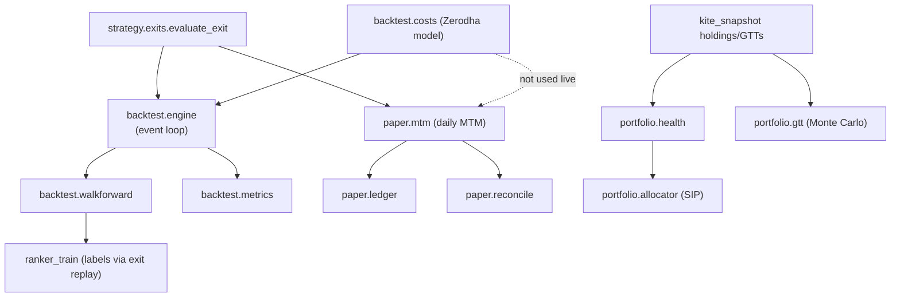
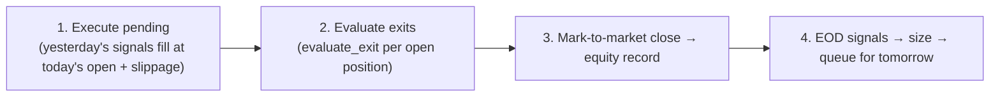
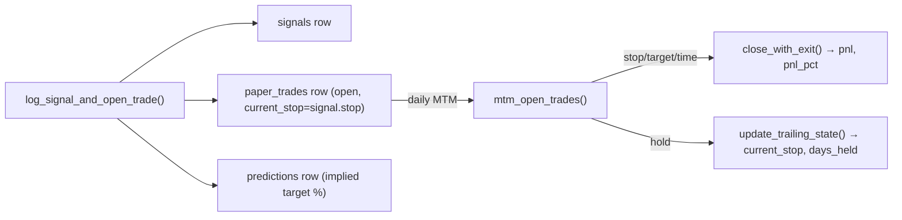

# 05 — Backtest, Portfolio & Paper

> Part of the [`docs/architecture/`](./PROGRESS.md) set. Three subsystems that
> all reuse the Phase-6 exit logic and Phase-7 cost model:
> **`backtest/`** (offline strategy evaluation), **`portfolio/`** (live-holdings
> intelligence), **`paper/`** (simulated live trading). Grounded in source.

## 1. How they relate

The exit state machine is the shared spine: the backtester, the ranker's label
generator, and the live paper MTM all call the *same* `evaluate_exit`. That
consistency is the design's biggest strength — but the **cost model diverges**
between backtest (full Zerodha costs) and paper (no cost applied at all, §4).

## 2. `backtest/`

### 2.1 Cost model (`costs.py`)
A Zerodha equity-delivery model, all rates as decimals:

| Component | Rate | Notes |
|---|---|---|
| Brokerage | `min(₹20, 0.03% × value)` | delivery is really free; ₹20 floor for realism |
| STT | 0.1% buy + 0.1% sell | |
| Exchange txn | 0.00297% per side | |
| SEBI | 0.0001% per side | |
| Stamp duty | 0.015% **buy only** | |
| GST | 18% × (brokerage + exchange + SEBI) | |
| Slippage | 0.1% per side | applied as a **price shift**, not a fee |

`round_trip_cost_pct` ≈ 0.4% for a flat trade (pinned by a test). `buy_charges`/
`sell_charges` return a `CostBreakdown`; `apply_slippage` shifts the fill price
adversely.

### 2.2 Event-loop engine (`engine.py`)
Deviation from the spec's vectorbt plan — a hand-rolled daily loop so the same
`SignalProvider`/exit code runs live and in backtest. Per trading day:

- **Next-day-open fills** with slippage; orders are single-day TIF (dropped if
  the symbol has no bar next day). Cash-gated (skips a fill that exceeds cash).
- **Sizing** uses live equity and the per-sector deployed value (per-stock is
  always 0 since duplicate opens are blocked).
- **`signal_provider`** defaults to `rule_signal_provider` (Layer A); the ranker
  injects `RankerSignalProvider` through the same seam.
- **Force-close** any still-open positions at the last in-window close.

> **🔴 Cost-accounting bug (F-021):** `_evaluate_exits` adds only the **sell-side**
> charges to the returned `costs_total` (line 330); the engine's `total_costs`
> accumulator never adds the **buy-side** charges (the awkward comment at lines
> 192–194 admits the "clean approach" was never finished). Per-trade
> `Trade.costs_paid` *is* correct (buy + sell), but `BacktestResult.total_costs`
> understates total friction by roughly the buy-side half. Slippage is never in
> `costs` at all (it's a price shift) — fine, but worth stating when reporting
> "cost drag." → F-021.

### 2.3 Walk-forward (`walkforward.py`) & metrics (`metrics.py`)
- `windows()` enumerates rolling **3y train / 6mo test / 3mo step** folds;
  `run_walkforward` runs the engine per test fold and concatenates trades. The
  train slice is unused for the rules-only baseline (it's the Phase-16 ranker
  hook).
- `metrics.py` computes CAGR, Sharpe, Sortino, max drawdown, hit rate, profit
  factor, expectancy, avg R-multiple, and alpha/beta vs a benchmark, aggregated
  into a `MetricsBundle`. Pure; safe on empty/zero-variance input. A `TradeLike`
  `Protocol` decouples it from the concrete `Trade` (avoids the engine cycle).

## 3. `portfolio/` — live-holdings intelligence

### 3.1 Health scorer (`health.py`)
Pure vote classifier over three axis groups — technicals (above-200DMA, ATH
drawdown, RSI band, dist-to-52w-high), fundamentals (profit growth/CAGR, D/E,
ROE, P/E percentile), sentiment (30d score). Each available axis votes ±1/0;
`has_critical` is an **immediate EXIT veto**. Verdict from net votes: ≥ +3 HOLD,
≤ −3 EXIT, else TRIM; `votes_cast < 3` → TRIM ("insufficient evidence"). Score is
`50 + (net/votes_cast)×50` clamped to 0–100.

> **TRIM bias (F-022):** the module docstring says thresholds are *"divided by the
> number of available votes so the verdict scales gracefully"* — but
> `score_holding` uses **fixed** `±3`. In production **fundamentals are never
> fetched** (no fundamentals fetcher is wired; `HoldingContext.fundamentals` is
> always default/None), so only ≤4 technical + 1 sentiment axes vote. Reaching
> net +3 on ~4 noisy axes is hard, so nearly every holding lands on TRIM or
> "insufficient evidence" — exactly what today's bundle shows (all 10 holdings
> TRIM). The scorer is effectively technicals-only and structurally TRIM-biased.
> → F-022.

### 3.2 GTT viability (`gtt.py`)
For each Good-Till-Triggered order, an n-path GBM Monte Carlo over the remaining
horizon: drift = 60-day mean log-return, diffusion = 60-day std, Itô-corrected
(`drift − ½σ²`). Direction-aware hit test (`≥` for targets above spot, `≤`
below). Returns `probability_hit` + `expected_days_to_hit` (None if no path
hits). Graceful `note` when history < 61 bars or σ = 0. **Most GTT symbols lack
parquet history** (only 12 symbols on disk, F-014), so many come back "no OHLCV
history on disk."

> Minor: the drift is the *realised* 60-day mean return, so a stock that just
> ran up projects a high P(hit) by momentum extrapolation — reasonable but
> optimistic in trending markets. Not filed; noted for the reviewer.

### 3.3 SIP allocator (`allocator.py`)
Pure `allocate_sip`: splits a ₹1L monthly budget across **TOPUP** (HOLD-rated
existing holdings that re-signal), **NEW** (non-holdings), and **CASH**. Caps:
50% topup, 50% new, 60% deployed total, 25%/stock, 30%/sector, 5 concurrent.
Greedy priority-ordered fill; rounds to whole rupees; emits a `skipped` list with
reasons. Caps are taken against the *post-investment* baseline (portfolio +
deployable). Note the dependency on health: since health is TRIM-biased (F-022),
the **TOPUP bucket rarely fires** (needs a HOLD verdict), so SIP skews to NEW/CASH.

## 4. `paper/` — simulated live trading

### 4.1 Lifecycle (`ledger.py`)

`log_signal_and_open_trade` is atomic (signal + trade + prediction in one call).
`close_with_exit` raises if the trade is missing or already closed (guards
double-close). SQL stays in `store.repo`; this module is the workflow layer.

### 4.2 Mark-to-market (`mtm.py`)
`mtm_open_trades(conn, bars, as_of)` reconstructs each open trade's `TradeState`,
runs `evaluate_exit` against the supplied bar, and either closes or ratchets.
The bar source is the caller's choice — Kite quotes at mid-day, official close at
post-close, parquet on replay. Missing bar → SKIP (surfaced, not mis-marked).

> **🔴 `days_held` double-count (F-024):** line 104 does `days_held = (trade.days_held
> or 0) + 1` — it bumps **per MTM call**. Both `mid-day --apply` and
> `post-close --apply` call `mtm_open_trades` on the same calendar day, so a held
> trade gains **2 days per calendar day**. The 25-day time stop therefore fires
> after ~12 calendar days, and the trailing-day accounting is off. Latent today
> (no open trades yet) but a real exit-timing bug once trades open. → F-024.

### 4.3 Reconcile (`reconcile.py`)
At post-close: (1) `evaluate_matured_predictions` fills
`actual_return_at_horizon`/`error_pct` for predictions whose horizon elapsed *or*
whose paper-trade closed; (2) `compute_portfolio_snapshot` writes the daily
equity row (cash + open-position MTM, peak-relative drawdown).

> **✅ Realised P&L now compounds (F-023, fixed 2026-06-16):** cash is no longer a
> caller constant. `compute_paper_cash` derives the live balance from the trade
> ledger — `initial_capital` minus Σ(`entry_price × qty`) over opened trades plus
> Σ(`exit_price × qty`) over closed trades, date-filtered so an old `as_of`
> reproduces that day's balance. `compute_portfolio_snapshot` calls it, so
> `equity` = derived cash + open-position MTM and a closed winner's gain stays in
> the curve. `reconcile_day`/`run_post_close` and the CLI now take
> `initial_capital` (was the constant `cash`; `--cash` → `--capital`). Costs are
> still excluded — that plugs into the same debit/credit seam under F-025.

---

## ⚠️ Robustness notes / open questions

- **✅ Equity curve reflects realised P&L (F-023, fixed 2026-06-16).** Cash is
  derived from the trade ledger (`compute_paper_cash`: debit on open, credit on
  close) and equity = derived cash + open MTM, mirroring the backtest engine. The
  headline performance artifact is now a true track record. Costs/slippage still
  pending under F-025 (same debit/credit seam).
- **`days_held` double-counts across mid-day + post-close (F-024).** Bump
  days_held once per *calendar day* (or derive it from `ts_entry`), not per MTM
  call.
- **Backtest `total_costs` understates friction (F-021).** Add buy-side charges
  to the accumulator; consider also reporting slippage drag separately.
- **Health is structurally TRIM-biased (F-022)** because fundamentals are never
  fetched and the threshold-scaling described in the docstring isn't implemented.
  Either wire a fundamentals source or scale thresholds by `votes_cast` as
  documented.
- **Cost model asymmetry:** the backtest applies full Zerodha costs, but paper
  MTM applies **none** — paper "fills" are at the raw bar/quote price with no
  slippage or charges. Paper results will look better than the backtest predicts.
  → F-025.
- **GTT/health depend on parquet that mostly doesn't exist** (F-014) — many
  holdings/GTTs can't be projected until the universe is ingested.
