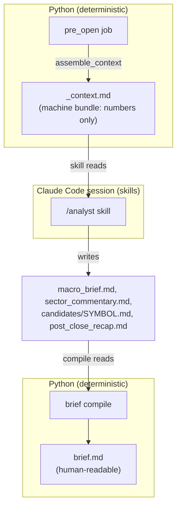

# 06 — LLM Layer & Claude Code Skills (`llm/`, `.claude/skills/`)

> Part of the [`docs/architecture/`](./PROGRESS.md) set. Covers how the system
> uses an LLM and the broker without putting either inside the batch Python: the
> `llm/` context/brief pipeline plus the three Claude Code **skills**. Grounded
> in `src/trading/llm/*.py` and `.claude/skills/*/SKILL.md`.

## 1. The human/LLM-in-the-loop contract

The system deliberately splits work between deterministic Python and an
interactive Claude Code session. Python does all *computation*; the LLM does
*narrative and broker I/O*. They communicate through files on disk — never
in-process calls.

Three reasons for this design (recap of [00-overview §1](./00-overview.md)):
- **No API spend** — the user has Claude Pro, not API credits, so the LLM runs in
  the Claude Code session via skills rather than the `anthropic` SDK.
- **Secrets stay interactive** — broker (Kite) access is via MCP tools the session
  holds; Python only reads the JSON the skill writes.
- **Separation of concerns** — the LLM never does arithmetic; it reads computed
  numbers and writes prose. This bounds hallucination to *interpretation*, not
  *data*.

## 2. `llm/context.py` — the machine bundle

`assemble_context(conn, paths, as_of, mode, inputs) → _context.md`. A pure
renderer: it pulls from SQLite (`macro_snapshot`, `sector_daily`,
`sentiment_daily`, `news_items`, open `paper_trades`, matured `predictions`) and
from caller-supplied `ContextInputs` (the ephemeral `candidates`,
`holdings_health`, and optional `scored_candidates` that don't live in any
table). Sections, in order:

| Section | Source | Empty-state |
|---|---|---|
| Header | `as_of` + `mode` + assembly timestamp | — |
| `## Macro snapshot` | `macro_snapshot` row | `_(no data)_` |
| `## Sector momentum` | `sector_daily` (sorted by 20d RS) | `_(no data)_` |
| `## Today's candidates` | `inputs.candidates` + per-symbol news + sector bullet | `_(no data)_` |
| `## Layer B ranker` | `inputs.scored_candidates` (omitted if None) | section absent |
| `## Holdings health` | `inputs.holdings_health` | `_(no data)_` |
| `## Open paper-trades` | open `paper_trades` | `_(no data)_` |
| `## Matured predictions` | `predictions` (post_close only) | `_(no data)_` |

Every empty section renders the literal `_(no data)_` **on purpose** — it's a
signal to the analyst (and the reader) that a source was genuinely empty, not
that the renderer broke. The per-symbol news query caps `ts ≤ as_of` end-of-day
(Phase 12.5.2) so future-dated NSE events don't leak into "recent headlines".

`ContextInputs.candidates` are passed in by the job — note these are the
*all-candidates* list (incl. partial passes), which is why the bundle shows
"passes 9/10" rows even though none all-pass.

## 3. `llm/briefing.py` — compile to `brief.md`

`compile_brief(date_dir, mode)` concatenates the analyst's narrative files into a
single `brief.md` in a fixed section order:

1. Macro · 2. Sector commentary · 3. Candidates (one block per symbol) ·
4. (optional) mid-day update · 5. (optional) post-close summary ·
6. (post_close) post-close recap.

- **Required vs optional** — `required_parts` = `macro_brief.md` + one
  `candidates/{SYMBOL}.md` per bundle candidate (+ `post_close_recap.md` in
  post_close mode). Missing required parts raise `MissingNarrativeError` (so a
  half-run is *loud*). `sector_commentary.md` is optional — a placeholder body is
  substituted, header kept.
- **Symbol list** is parsed from the bundle with the regex
  `^### ([A-Z0-9_]+) — passes \d+/\d+ rules`. Orphan candidate files (a symbol not
  in the bundle) are skipped with a stderr warning.
- **Mode** is inferred from the bundle header (`(mode: post_close)`) if not
  passed.

> **Brittle three-way coupling (F-027):** the candidate heading string is written
> by `context._render_candidates`, re-written in place by `pre_open_iep` when it
> reorders candidates, and parsed by `briefing._CANDIDATE_HEADING`. All three must
> agree on the exact `### SYM — passes N/M rules` format. A change in any one
> silently breaks symbol parsing (candidates dropped from the brief, or an
> orphan-warning storm) with no test spanning the three. → F-027.

## 4. The three skills (`.claude/skills/`)

Each skill is a `SKILL.md` the Claude Code session executes. They are the only
place MCP / the LLM is invoked.

### 4.1 `/kite-snapshot` — broker holdings/GTTs
Probes `mcp__kite__get_profile`; on auth failure it halts and tells the user to
run `mcp__kite__login` (no partial writes). Otherwise calls
`mcp__kite__get_holdings` / `get_gtts` (and optionally `get_positions`), maps each
row to the `data.kite` dataclass field names, and writes
`data/raw/<date>/{holdings,gtts,positions}.json` atomically plus `_meta.json`
(`source: "mcp"`). Consumed by `data.kite_snapshot` ([03 §3.4](./03-data-layer.md)).

### 4.2 `/kite-quotes-snapshot` — intraday quotes
Reads `_quote_symbols.txt` (written by `mid-day`/`post-close` prepare). Halts if
absent. Calls `mcp__kite__get_quotes` for the (NSE-defaulted) symbols, writes
`quotes_HHMM.json` (HHMM = capture time, the staleness source of truth), and
merges `quotes_at` into `_meta.json`. Consumed by `data.quotes_snapshot`.

### 4.3 `/analyst` — the narrative
Reads the most recent `_context.md`, and writes `macro_brief.md`,
`sector_commentary.md` (optional), `candidates/{SYMBOL}.md` per candidate, and
(post_close) `post_close_recap.md`, following fixed skeletons so `compile_brief`'s
headings parse. Style rules: **evidence-first** (cite numbers from the bundle,
never invent), concise word caps, and a conviction (HIGH/MEDIUM/LOW) justified in
the body. **Refuse-stale:** if the bundle's `_Assembled at_` timestamp is > 12 h
old, it must refuse and tell the user to re-assemble.

## 5. Where the trust boundaries are

| Boundary | Enforced by | Risk |
|---|---|---|
| Broker JSON shape | skill convention only | malformed write → `Dataclass(**row)` error (F-002) |
| Quote freshness | `quotes_snapshot` code (30 min) | code-enforced ✅ |
| Bundle freshness (analyst) | **the LLM following SKILL.md** | advisory only — a compliant model refuses, but nothing in code blocks a stale narrative |
| Narrative accuracy | **the LLM following "evidence-first"** | no code checks the prose against the bundle numbers — interpretation can drift or hallucinate |
| Candidate heading format | shared string across 3 modules | silent breakage on change (F-027) |

## 6. Current-state note

Because the daily flow is manual, the brief only exists for a date if a human ran
`/analyst` *and* `brief compile` after `pre-open`. `pre-open` writes the bundle
unconditionally, so the machine context is always present; the *narrative* is the
human-dependent part. A skipped `/analyst` makes `compile_brief` raise on the
missing required parts — loud, which is good, but there's no automated fallback or
"narrate-later" path. Ties to F-003 (half-run detection).

---

## ⚠️ Robustness notes / open questions

- **Narrative is unverified against the bundle (F-026).** The "evidence-first"
  rule is an instruction to the LLM, not a check. A wrong number or an invented
  event in `brief.md` would pass through. For a brief that informs trade
  decisions, a lightweight post-compile validator (e.g. assert any figure quoted
  in `macro_brief.md` matches the macro row, flag symbols mentioned that aren't in
  the bundle) would raise confidence. → F-026.
- **Refuse-stale is advisory.** The 12-hour gate lives in `SKILL.md` text, so it
  depends on the model honouring it. Moving a staleness check into `compile_brief`
  (compare `_Assembled at_` to file mtimes / now) would make it deterministic.
- **Three-way heading coupling (F-027)** has no spanning test.
- **Manual narrative step** means no brief on days the human skips `/analyst`;
  acceptable for solo use but a single point of process failure (F-003).
- **`assemble_context` docstring is stale** — it lists "header, macro,
  candidates, holdings health, open trades, matured predictions" and omits the
  sector and ranker sections added in Phases 12.6/16. Minor. → F-028.
