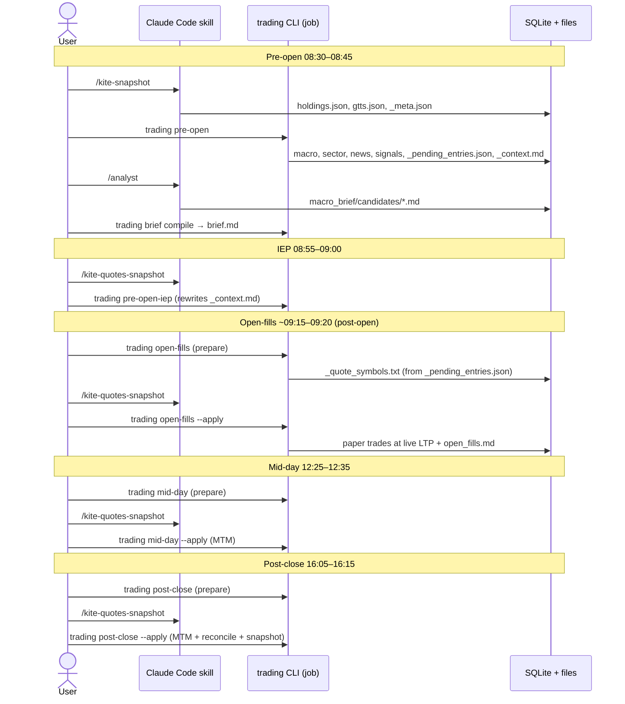
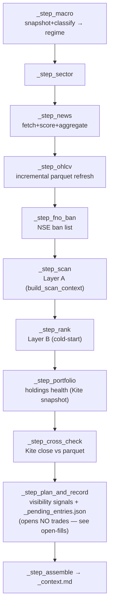

# 07 — Jobs & Workflows (`jobs/`)

> Part of the [`docs/architecture/`](./PROGRESS.md) set. The orchestration layer:
> eight jobs (pre_open, pre_open_iep, open_fills, mid_day, post_close,
> weekly_train, monthly_sip, daily_unattended) that wire the lower layers into
> the daily/weekly/monthly cadence. This
> phase originally **confirmed F-018** (no OHLCV refresh; ✅ fixed 2026-06-16 —
> `pre_open` now refreshes OHLCV + a staleness guard) and **F-019** (dead
> risk gates; ✅ fixed 2026-06-16 — `build_scan_context` wires them), and shows
> how F-022/F-023/F-024 manifest at the job level. Grounded in
> `src/trading/jobs/*.py`.

## 1. Shared shape

Every job follows the same skeleton — a genuinely clean, consistent design:

- A frozen `*Result` dataclass returned to the CLI (counts + `warnings` + output
  paths).
- A `*Aborted` exception for a missing hard prerequisite (the Kite/quote
  snapshot) → CLI catches it and exits **2** with remediation.
- `configure_logging(<job>)` at the entrypoint; `get_conn` + `run_migrations`
  inside.
- **Graceful degradation:** soft steps catch their own errors, append to
  `warnings`, and continue; only the snapshot prerequisite aborts.
- **Idempotency:** SQLite UPSERTs + guards (`_already_opened_today`,
  `has_row_for_train_end`) + atomic file writes.
- **Two-phase (open_fills/mid_day/post_close):** `prepare` writes
  `_quote_symbols.txt`; the `/kite-quotes-snapshot` skill runs; `apply` consumes
  the quotes.

## 2. The daily lifecycle

## 3. `pre_open` — the morning pipeline

`run_pre_open` runs eleven steps in dependency order, all inside one connection:

**Degradation matrix:**

| Step | On failure | Hard-abort? |
|---|---|---|
| macro | warn, regime defaults `NEUTRAL` | no |
| sector | warn, `sector_written=False` | no |
| news | warn, `(0,0)` | no |
| scan | (reads parquet; missing symbol skipped) | no |
| rank | warn, cold-start (all selected) | no |
| **portfolio** | **`PreOpenAborted` → exit 2** (missing/stale Kite snapshot) | **yes**, unless `require_snapshot=False` (the `daily-unattended` broker-free spine degrades to empty holdings) |
| plan_and_record | per-candidate warn (ATR≥close skip) | no |
| assemble | always writes bundle | no |

**Idempotency:** `already_opened_today` keeps an already-held symbol out of
`_pending_entries.json` on re-run; visibility signals dedupe via
`insert_signal(or_ignore=True)` on the v8 partial unique index (F-030).
Macro/sector/news/sentiment all UPSERT.

This single job is where four findings from earlier phases concretely originate:

- **F-018 (✅ fixed 2026-06-16):** `_step_ohlcv` now runs `refresh_ohlcv` before
  `_step_scan`, and `scan()` skips bars older than `MAX_BAR_AGE_DAYS` with a
  warning (plus a Kite close cross-check on holdings). The scan no longer runs
  silently on stale data.
- **F-019 (✅ fixed 2026-06-16):** `_step_scan` now builds the context via
  `build_scan_context(conn, as_of)`, wiring the regime/VIX gate (from the macro
  snapshot) and the critical-news veto (from `sentiment_daily.has_critical`)
  computed earlier in the *same* run. Ban-list/T2T stay no-ops pending NSE feeds
  (F-010).
- **F-022 (✅ fixed 2026-06-16):** `_step_portfolio` ~~built each `HoldingContext`
  with empty Fundamentals/Sentiment, so health was technicals-only and the
  `has_critical` EXIT veto could never fire~~ now routes through
  `build_holding_context`, which pulls the latest `sentiment_daily` rollup
  (veto live) + static-CSV fundamentals; and `score_holding` scales the ±3 cut by
  `votes_cast` so a technicals-only ballot still reaches HOLD/EXIT.
- **F-029 (✅ fixed 2026-06-16):** `_step_auto_open` ~~hardcoded
  `predicted_return_pct=20.0` and `target = close × 1.20` for **every** signal~~
  now sets `signal.target = target_price(cand.close, stop_price)` — the exit
  engine's `min(+20%, 2.5R)` — and drops the hardcoded prediction, so
  `predicted_return_pct` defaults to the signal's implied target % and varies per
  signal. Calibration buckets are meaningful and `signal.target` agrees with the
  exit engine.

> **F-030 (✅ fixed 2026-06-29):** visibility-only signals ~~were inserted
> unconditionally, duplicating on re-run~~ now dedupe via migration v8's partial
> unique index (`symbol, ts WHERE created_by='pre_open'`) +
> `insert_signal(or_ignore=True)`, scoped so selected/open_fills rows are
> unaffected.

> **Plan/fill split (2026-06-23 design).** The old `_step_auto_open` (paper
> trades at the D-1 close) is gone: `_step_plan_and_record` only *records* the
> selected candidates to `_pending_entries.json`. Fills happen post-open in the
> dedicated `open_fills` job (§4a) at the live LTP.

## 4. `pre_open_iep` — the 08:55 gap filter

`run_pre_open_iep` reads the existing `_context.md` candidates + the latest Kite
quotes + parquet D-1 closes + the macro regime; computes overnight gaps; applies
a regime filter (and optional sector filter); reranks survivors by
`gap_norm×0.6 + sector_pct×0.4`; and **rewrites `_context.md` in place**. Quotes
missing → warns, `quotes={}`, no gaps (degrades to "keep all"). Regime missing →
NEUTRAL. This is the one job that mutates a bundle another tool produced — it
must preserve the `### SYM — passes N/M rules` heading format the briefing parser
expects (F-027).

## 4a. `open_fills` — the post-open fill block (~09:15)

`run_open_fills` (2026-06-23 design) is two-phase like the MTM jobs:

- **prepare** — reads `_pending_entries.json` (missing file → graceful no-op
  with a warning, so a day with no candidates needs no quotes) and writes
  `_quote_symbols.txt` for the skill.
- **apply** — `read_latest_quotes` (missing/stale snapshot →
  `OpenFillsAborted` → exit 2: *never* fill on old prices); per pending symbol
  recomputes `stop = LTP − 1.5×ATR₁₄` and `target = target_price(LTP, stop)`;
  drops symbols with no quote, `LTP ≤ stop`, or `already_opened_today`; then
  re-runs the **same daily-budget planner** as a real morning would —
  `plan_daily_entries` with live cash (`compute_paper_cash`), open-lot and
  sector caps (F-048), and the score→p_win calibration. Funded entries open via
  `log_signal_and_open_trade` with `created_by="open_fills"` and
  `ts = quote capture time`; selected-but-unfunded symbols get a
  visibility signal + a skip-reason warning. Writes
  `data/research/<date>/open_fills.md` (LTP vs `ref_close` drift table).

The point of the split: the paper book records a price an actual market order
could have gotten (~09:15 LTP), not the unfillable previous close — so the
Phase 18.5 OOS-Sharpe gate isn't flattered by fantasy fills. Note the drift is
also a measurement: `open_fills.md` shows per-symbol LTP-vs-close drift, i.e.
the gap risk the IEP filter (§4) was supposed to absorb.

## 5. `mid_day` & `post_close` — the MTM jobs

Both two-phase (prepare → skill → apply). `gather_quote_symbols` = open
paper-trades ∪ today's signals ∪ holdings. `apply` reads the freshest
`quotes_HHMM.json`, builds bars (`close = last_price`, **not** Kite's
yesterday-close), and runs `mtm_open_trades`.

- **mid_day** stops here, writing `mid_day_update.md`. Intraday quote bars have
  `high/low` from the live snapshot, so an intraday stop/target *can* close a
  trade before post-close.
- **post_close** additionally runs `reconcile_day` (matured predictions +
  portfolio snapshot) and writes `post_close_summary.md`.

> Two confirmed findings surface here:
> - **F-024 (✅ fixed 2026-06-16):** both jobs call `mtm_open_trades`, which
>   ~~bumped `days_held` per call → 2 days per calendar day → 25-day time stop at
>   ~12 days~~ now derives `days_held = np.busday_count(ts_entry, as_of)`, so the
>   two same-day passes yield the same value and the time stop fires on schedule.
> - **F-023 (✅ fixed 2026-06-16):** `run_post_close` now passes `initial_capital`
>   (the t=0 seed) into `reconcile_day`, which derives live cash from the trade
>   ledger via `compute_paper_cash` (debit on open, credit on close). So
>   `portfolio_snapshots.equity` = derived cash + open-MTM and realised P&L
>   compounds into the equity curve.

## 6. `weekly_train` — Sunday retrain + review

`run_weekly_train` (Task Scheduler, Sundays): `_step_retrain` does a rolling-3y
`train_walkforward` (graceful; `InsufficientDataError` continues), saves the
pickle, appends a registry row, and applies the soft-promotion gate; then
`gather_review_data` + `render_weekly_review` writes
`data/research/weekly/<date>_review.md` and a Slack summary. The registry guard
(`has_row_for_train_end`) makes Sunday re-runs idempotent.

> Two knock-on effects of earlier findings:
> - The review's **"Cumulative Sharpe (portfolio snapshots)"** is computed from
>   the equity curve — now that F-023 is fixed (cash compounds realised P&L), this
>   Sharpe is trustworthy, which matters because it is *exactly the metric the
>   Phase 18.5 go/no-go gate uses*.
> - The **calibration** section groups by `predicted_return_pct`, which ~~is always
>   +20%~~ now varies per signal (F-029 fixed 2026-06-16: prediction derives from
>   `signal.target = min(+20%, 2.5R)`), so the buckets are meaningful.
> - ~~`_step_retrain` passes `negative_news_lookup={}` — the `negative_news_count_7d`
>   feature is always empty in *training* (though populated at inference).~~ **F-031
>   fixed 2026-06-18:** `load_training_inputs` now builds `negative_news_lookup` via
>   the same `news_store.negative_news_count_7d` inference uses, so the feature is
>   computed identically on both paths.

## 7. `monthly_sip` — 1st-of-month plan

`run_monthly_sip` reads holdings (Kite snapshot; `MonthlySipAborted` if absent),
scores each holding (`_score_holdings` — fundamentals + latest sentiment now wired
via `build_holding_context`, F-022),
gathers candidates from `signals` in the trailing 10-trading-day window
(priority = max `ml_score`, dedup by symbol), runs `allocate_sip`, and writes
`sip_plan.md` + Slack. `gate_holidays=False` on its reminder slot so it fires on
the 1st even if a holiday.

> With the F-022 votes_cast scaling fixed (2026-06-16), a technicals-strong
> holding can earn HOLD, so the **TOPUP bucket can fire** rather than SIP always
> skewing to NEW/CASH. With the ranker in
> cold-start, candidate `priority` is 0 for all (ml_score NULL→0), so ordering is
> arbitrary-but-stable.

## 8. Degradation & idempotency summary

| Job | Hard prereq (abort) | Re-run safety |
|---|---|---|
| pre_open | Kite snapshot (unless broker-free spine) | UPSERTs + `already_opened_today`; visibility signals dedupe via v8 partial index (F-030 ✅) |
| pre_open_iep | `_context.md` present | rewrites in place (idempotent-ish) |
| open_fills | fresh quotes (`OpenFillsAborted` → exit 2); no pending file → no-op | `already_opened_today` keeps re-runs from double-opening; markdown overwrite by date |
| mid_day | fresh quotes | MTM persists; re-run re-evaluates (days_held derived, no double-count — F-024 ✅) |
| post_close | fresh quotes | snapshot UPSERT by date; MTM persists |
| weekly_train | none (review always written) | `has_row_for_train_end` guard |
| monthly_sip | Kite snapshot | plan file overwrite by date |

---

## ⚠️ Robustness notes / open questions

- **✅ (Fixed 2026-06-16) No OHLCV refresh in the daily flow (F-018).** Was the
  single biggest operational gap. `pre_open._step_ohlcv` now refreshes parquet
  before the scan, and `scan()` skips stale symbols (>`MAX_BAR_AGE_DAYS`) with a
  warning rather than scanning silently-old prices.
- **✅ (Fixed 2026-06-16) Predictions ~~are a constant +20%~~ now vary per signal
  (F-029).** `signal.target` uses the exit engine's `min(+20%, 2.5R)` (public
  `target_price`) and `predicted_return_pct` derives from it, so the
  prediction-calibration apparatus (reconcile → weekly review → dashboard scatter)
  measures error against a real, per-signal target.
- **✅ (Fixed 2026-06-16) The Phase 18.5 decision metric is now off a sound equity
  curve (F-023).** Paper cash is derived from the trade ledger and compounds
  realised P&L (`compute_paper_cash`), so "OOS Sharpe > 1.0" can be trusted.
- **✅ (Fixed 2026-06-16) Paper closes now carry the backtest's costs (F-025).**
  `ledger.buy_side_cost`/`sell_side_cost` (reuse of `backtest.costs`) net Zerodha
  charges + slippage into both `compute_trade_pnl` and `compute_paper_cash`, so the
  equity curve and OOS Sharpe aren't inflated by cost-free paper fills.
- **✅ Health veto + sentiment wired (F-022, 2026-06-16).** Both `pre_open` and
  `monthly_sip` now feed the latest `sentiment_daily` rollup + static-CSV
  fundamentals into health via `build_holding_context`, so the critical-news EXIT
  veto fires on holdings and the votes_cast-scaled verdict isn't TRIM-pinned.
- **✅ Visibility-only signals no longer duplicate on re-run (F-030, 2026-06-29).**
  Migration v8 partial unique index + `insert_signal(or_ignore=True)`.
- **Open-fills is invisible to run-status (F-062, open).** `ops/run_status.py`
  doesn't track the open-fills block, so `trading status` can report a complete
  day when no entries were ever filled. Second-phase finding — see
  `findings_second_phase.md`.
- **✅ Train/serve feature parity (F-031, 2026-06-18).** `negative_news_count_7d`
  used to be empty in training (`negative_news_lookup={}`) but populated at
  inference. Now a single `news_store.negative_news_count_7d` is the source of
  truth for both paths: inference calls it per candidate; `ranker_io` precomputes
  the training lookup with it (`build_negative_news_lookup`).
- **Strengths worth keeping:** the per-job `warnings` discipline, the abort/exit-2
  contract, the two-phase prepare/apply, and the registry idempotency guard are all
  solid and should be the template when wiring the fixes above.
