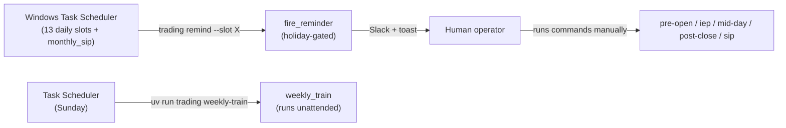

# 08 — Ops, CLI & UI (`ops/`, `cli.py`, `ui/`)

> Part of the [`docs/architecture/`](./PROGRESS.md) set. The final layer doc:
> cross-cutting operations, the operator command surface, and the dashboard.
> Grounded in `src/trading/ops/*.py`, `cli.py`, `ui/*.py`.

## 1. `ops/` — cross-cutting operations

Four small, well-isolated modules that everything else leans on.

### 1.1 `calendar.py` — the holiday gate
`is_trading_day(d)` = Mon–Fri **and** not in `nse_holidays(d.year)`. Holidays come
from `nsepython.holiday_master()` (parsed tolerantly for date formats), cached per
year (`@functools.cache`), with a **bundled JSON fallback**
(`data/static/nse_holidays_<year>.json`; the 2026 file exists). If both sources
fail, only the weekday check applies — a deliberate "rather over-trade on a
forgotten holiday than miss a real session" stance. This gate is what makes the
reminder dispatcher silently skip weekends/holidays.

### 1.2 `notify.py` — Slack + Windows toast
`notify(level, title, body)` fans out to a Slack incoming webhook
(`SLACK_WEBHOOK_URL`) and a `plyer` Windows toast. **Best-effort by contract:**
every failure (missing webhook, network, non-Windows) is caught and logged at
WARN; `notify` never raises, so a notification problem can't crash a job.
Multi-line / error bodies are fenced for Slack readability.

### 1.3 `logging_setup.py` — loguru sinks
`configure_logging(job)` (idempotent per process) installs three sinks: a rotating
file (`data/logs/{job}_YYYY-MM-DD.log`, daily rotation, 60-day retention, gzip),
colorised stderr, and — for ERROR+ — a **Slack sink** that formats the traceback
plus the last 20 log lines into a notification. The Slack sink itself is wrapped
so a notify failure can't crash the job.

### 1.4 `runner.py` — the reminder schedule
`SCHEDULE` is a static dict of `ReminderSlot`s (time, title, body, `gate_holidays`).
`fire_reminder(slot)` resolves today in IST, holiday-gates (silent skip on
non-trading days unless `gate_holidays=False`, as for `monthly_sip`), substitutes
`<date>`, and dispatches `notify`. **It runs nothing** — it just tells the human
what to run.

## 2. The automation model

This is the operational heart of the system, and it's important to state plainly:
**almost nothing is automated.** Windows Task Scheduler fires *reminders*; the
human runs every command.

| Trigger | What it does | Execution |
|---|---|---|
| 13 daily slots (pre_open ×4, iep ×2, mid_day ×3, post_close ×3) | Slack/toast "run command X" | **human** |
| `monthly_sip` slot (1st, `gate_holidays=False`) | reminder to run `trading sip` | **human** |
| `trading_weekly_train.xml` (Sunday) | runs `trading weekly-train` | **unattended** (only true automation) |

> **Live-run continuity gap (F-032):** because the daily pipeline is entirely
> human-run, any day the operator is unavailable leaves a hole — no Kite snapshot,
> no bundle, **no MTM and no exit management for open trades**, no portfolio
> snapshot. For a 3–6 month live paper-run whose output must be a continuous track
> record, missed days both break continuity and leave positions unmanaged.
> → F-032. Ties to F-003 (no half-run detection). (`days_held` is now
> calendar-derived, so a missed day no longer corrupts the exit-timing count —
> F-024 ✅.)

## 3. `cli.py` — the operator surface

A `typer` app; the project's single entry point (`trading …`). It's intentionally
**thin**: parse options → call a job or a module function → render a `rich` table.

- **Heavy/optional imports are function-local** (ranker, weekly_train, monthly_sip
  pull in `lightgbm`/`torch`) so `trading --help` and unrelated commands stay fast
  — the deliberate startup-cost pattern from [01 §3.4](./01-architecture.md).
- **Abort contract:** `PreOpenAborted` / `MidDayAborted` / `PostCloseAborted` /
  `MonthlySipAborted` are caught and turned into **exit code 2** with the
  remediation message ("run /kite-snapshot first").

Command groups (full list in [00-overview §5](./00-overview.md)): daily jobs,
periodic (weekly-train/sip), brief (assemble-context/compile), data ingest
(ingest-history/ingest-news/macro/sector), analysis (scan/backtest), portfolio &
paper, ranker (train-ranker/ranker-status), broker fallback (kite-emergency-*),
ops (remind/notify-test).

## 4. `ui/` — the Streamlit dashboard

Read-only visualisation; never writes. Four-module split:

| Module | Role |
|---|---|
| `ui/data.py` | cached readers — every dashboard read goes through here |
| `ui/charts.py` | pure Plotly figure builders (empty-state aware) |
| `ui/components.py` | Streamlit widgets (regime badge, KPI tiles, rule-chip grid…) |
| `ui/Home.py` + `pages/1–3` | Overview, Portfolio, Today's Signals, Paper Journal |

**`ui/data.py`** wraps each reader in `@st.cache_data(ttl=60)` (300s for OHLCV),
keyed on args; all degrade to `None`/empty rather than raising, so pages branch on
truthiness and render an empty-state. Readers cover macro/regime, portfolio
snapshots/equity, signals/trades/predictions, Kite holdings/GTTs/quotes (reusing
`data.kite_snapshot`/`quotes_snapshot`, so the dashboard honours the same staleness
rules — stale quotes are *shown* with an amber tag rather than hidden), parquet
OHLCV, and brief markdown.

> **User-facing impact of F-023 (✅ fixed 2026-06-16):** the Overview page's
> headline equity-curve and drawdown KPIs read `portfolio_snapshots` directly.
> Now that cash is derived from the trade ledger and compounds realised P&L
> (`reconcile.compute_paper_cash`), that curve is a true track record, so the
> Overview KPIs and the Paper-Journal closed-trade stats (`pnl` column) agree.

## 5. Where the layers leave the system today

- **Automation:** reminder-only daily flow + one unattended weekly job. Robust to
  external outages (everything degrades), fragile to operator absence (F-032).
- **Observability:** good — per-job rotating logs, ERROR→Slack, a live dashboard.
- **The interfaces are solid;** the gaps are upstream (data coverage, gate wiring,
  paper accounting), not in `ops`/`cli`/`ui`.

---

## ⚠️ Robustness notes / open questions

- **Live-run continuity depends entirely on the human (F-032).** Consider
  promoting the read-only, no-broker steps (macro, sector, news, scan, OHLCV
  refresh) to *run* unattended like `weekly_train` — only the Kite-dependent steps
  truly need the interactive session. That would keep the macro/scan/track-record
  spine continuous even on missed days.
- **✅ (Fixed 2026-06-16) The dashboard's headline equity curve (F-023)** now
  reflects compounded realised P&L (`compute_paper_cash`), so the Overview KPI is
  a sound track record.
- **Local-clock assumptions** in `logging_setup` (`date.today()`) and the quote
  staleness check assume host == IST (F-004 family) — fine on the one machine,
  worth centralising.
- **Holiday cache never refreshes in a long-running process** (`@functools.cache`)
  — irrelevant for short CLI jobs, a minor staleness risk for a long-lived
  Streamlit session that spans a year boundary. Low.
- **Strengths to keep:** the best-effort notify contract, idempotent logging
  setup, the thin-CLI + exit-2 abort discipline, and the uniformly graceful,
  cached, read-only UI data layer are all exemplary and should be the model for
  new surfaces.
