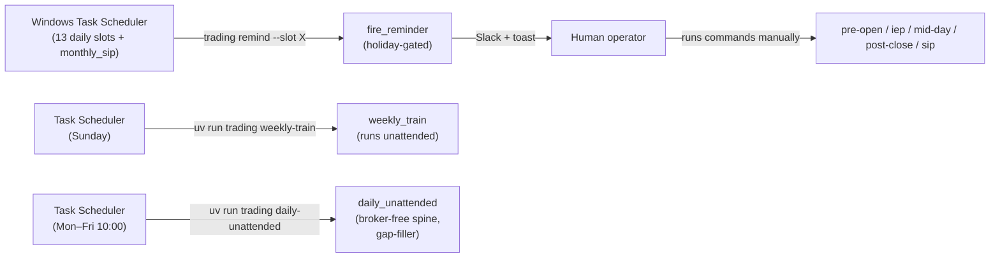

# 08 — Ops, CLI & UI (`ops/`, `cli.py`, `ui/`)

> Part of the [`docs/architecture/`](./PROGRESS.md) set. The final layer doc:
> cross-cutting operations, the operator command surface, and the dashboard.
> Grounded in `src/trading/ops/*.py`, `cli.py`, `ui/*.py`.

## 1. `ops/` — cross-cutting operations

Five small, well-isolated modules that everything else leans on.

### 1.1 `calendar.py` — the holiday gate
`is_trading_day(d)` = Mon–Fri **and** not in `nse_holidays(d.year)`. Holidays come
from `nsepython.holiday_master()` (parsed tolerantly for date formats), cached per
year (`@functools.cache`), with a **bundled JSON fallback**
(`data/static/nse_holidays_<year>.json`; the 2026 file exists). If both sources
fail, only the weekday check applies — a deliberate "rather over-trade on a
forgotten holiday than miss a real session" stance. This gate is what makes the
reminder dispatcher silently skip weekends/holidays.

### 1.2 `notify.py` — Slack + Windows toast
`notify(level, title, body)` fans out to a Slack incoming webhook
(`SLACK_WEBHOOK_URL`) and a `plyer` Windows toast. **Best-effort by contract:**
every failure (missing webhook, network, non-Windows) is caught and logged at
WARN; `notify` never raises, so a notification problem can't crash a job.
Multi-line / error bodies are fenced for Slack readability.

### 1.3 `logging_setup.py` — loguru sinks
`configure_logging(job)` (idempotent per process) installs: a rotating file
(`data/logs/{job}_YYYY-MM-DD.log`, daily rotation, 60-day retention, gzip),
colorised stderr, and a durable **`data/logs/failures.log`** (ERROR+, synchronous,
job-tagged) — the single place to flag-and-fix any job failure. A **Slack/toast
error sink** is **opt-in**: `slack_on_error` defaults to the `TRADING_SLACK_ON_ERROR`
env flag (off unless set), so a failing job records to `failures.log` rather than
pushing an error notification to Slack/Windows on every run. When enabled, the sink
formats the traceback plus the last 20 log lines and is wrapped so a notify failure
can't crash the job. The scheduled `weekly-train` / `sip` CLI commands `logger.exception`
on an unexpected failure before re-raising, so the durable record is always written.

> **Test isolation (important):** loguru is a process-wide singleton, so an ERROR
> sink installed by one test used to leak into later tests and fire real
> Slack/toast notifications (the "monthly_sip/weekly_train FAILED" spam). The
> autouse `tests/conftest.py::_isolate_notifications` fixture now drops
> `SLACK_WEBHOOK_URL`, nulls the toast backend, and resets loguru sinks after every
> test, so the suite can never emit a real notification.

### 1.4 `runner.py` — the reminder schedule
`SCHEDULE` is a static dict of `ReminderSlot`s (time, title, body, `gate_holidays`).
`fire_reminder(slot)` resolves today in IST, holiday-gates (silent skip on
non-trading days unless `gate_holidays=False`, as for `monthly_sip`), substitutes
`<date>`, and dispatches `notify`. **It runs nothing** — it just tells the human
what to run.

### 1.5 `run_status.py` — half-run / missed-step detection (F-003)
The daily flow is ~13 manually-run commands; nothing reconciled *which* steps
ran on a date, so a skipped block (IEP, post-close) failed silently.
`compute_status(paths, as_of)` infers per-step completion **purely from the
durable artifact each step leaves** — `holdings.json` (snapshot), `_context.md`
(scan), `macro_brief.md` (analyst), `brief.md` (compile), an IEP-band
`quotes_*.json`, `_context.md` re-touched after those quotes (IEP filter),
`mid_day_update.md` (mid-day), and `post_close_summary.md` **or** a
`portfolio_snapshots` row (post-close). No job or skill stamps anything. It
tracks **8 checkpoints across the 4 blocks** (the two `prepare` steps share one
overwritten `_quote_symbols.txt`, so the block's "apply" output is the
meaningful completion signal). The report is **time-aware**: an un-run step is
`missing` only once its IST slot time has passed (or for any past date), else
`pending`; non-trading days are `n/a`. `has_due_failure` drives the
`trading status` exit code (1 on a real half-run), so cron/scripts can gate on
it.

### 1.6 `retention.py` — data prune (F-013)
`data/raw/<YYYY-MM-DD>/` snapshot dirs and the append-only `news_items` table
grew without bound. `run_retention(paths, conn, ...)` prunes the stale tail of
each: `prune_raw_dirs` deletes only `raw_dir/` children whose **name parses as an
ISO date** older than the cutoff (non-date entries are never touched), and
`prune_news` deletes `news_items` rows older than the cutoff — the derived
`sentiment_daily` rollups are **kept** (tiny, and feed the live 30-day health
scorer), so dropping old raw news is lossless for the live path. Defaults: **raw
30 days, news 365 days**. Everything is **dry-run unless `apply=True`** (mirroring
the daily-job apply discipline). It runs two ways: the `trading prune` command
(dry-run by default, `--apply`/`--raw-days`/`--news-days`) and automatically as a
housekeeping step inside the Sunday `weekly_train` (so cleanup happens unattended).

## 2. The automation model

This is the operational heart of the system, and it's important to state plainly:
**the interactive daily flow is reminder-driven** — Windows Task Scheduler fires
*reminders* and the human runs each command. Two jobs run **unattended**: the
Sunday `weekly_train`, and (F-032) a weekday **`daily_unattended`** gap-filler
that runs the broker-free pre-open spine on operator-absent days.

| Trigger | What it does | Execution |
|---|---|---|
| 13 daily slots (pre_open ×4, iep ×2, mid_day ×3, post_close ×3) | Slack/toast "run command X" | **human** |
| `monthly_sip` slot (1st, `gate_holidays=False`) | reminder to run `trading sip` | **human** |
| `trading_weekly_train.xml` (Sunday) | runs `trading weekly-train` (retrain + review + retention prune) | **unattended** |
| `trading_daily_unattended.xml` (Mon–Fri 10:00) | runs `trading daily-unattended` — broker-free spine, skips days already covered | **unattended** |

> **Live-run continuity (F-032 — partly closed):** the interactive pipeline is
> still human-run, but the **macro/scan/auto-open/track-record spine no longer
> depends on the operator** — `daily_unattended` runs it broker-free
> (`require_snapshot=False`) on any trading day the operator hasn't already
> covered (detected via the `trading status` artifact probe), so the bundle,
> signals, and paper-trades are produced even on missed days (F-032 ✅).
> **Still gapped:** MTM / exit-management of open trades needs live Kite quotes
> and stays interactive — a missed *afternoon* is not back-filled. Half-run
> detection exists (`trading status`, F-003 ✅), and `days_held` is
> calendar-derived so a missed day doesn't corrupt the exit-timing count
> (F-024 ✅).

## 3. `cli.py` — the operator surface

A `typer` app; the project's single entry point (`trading …`). It's intentionally
**thin**: parse options → call a job or a module function → render a `rich` table.

- **Heavy/optional imports are function-local** (ranker, weekly_train, monthly_sip
  pull in `lightgbm`/`torch`) so `trading --help` and unrelated commands stay fast
  — the deliberate startup-cost pattern from [01 §3.4](./01-architecture.md).
- **Abort contract:** `PreOpenAborted` / `MidDayAborted` / `PostCloseAborted` /
  `MonthlySipAborted` are caught and turned into **exit code 2** with the
  remediation message ("run /kite-snapshot first").

Command groups (full list in [00-overview §5](./00-overview.md)): daily jobs,
periodic (weekly-train/sip/daily-unattended), brief (assemble-context/compile),
data ingest (ingest-history/ingest-news/macro snapshot·refresh/sector), analysis (scan/backtest),
portfolio & paper, ranker (train-ranker/ranker-status), broker fallback
(kite-emergency-*), ops (remind/notify-test/status/prune).

## 4. `ui/` — the Streamlit dashboard

Read-only visualisation; never writes. Four-module split:

| Module | Role |
|---|---|
| `ui/data.py` | cached readers — every dashboard read goes through here |
| `ui/charts.py` | pure Plotly figure builders (empty-state aware) |
| `ui/components.py` | Streamlit widgets (regime badge, KPI tiles, rule-chip grid…) |
| `ui/Home.py` + `pages/1–3` | Overview, Portfolio, Today's Signals, Paper Journal |

**`ui/data.py`** wraps each reader in `@st.cache_data(ttl=60)` (300s for OHLCV),
keyed on args; all degrade to `None`/empty rather than raising, so pages branch on
truthiness and render an empty-state. Readers cover macro/regime, portfolio
snapshots/equity, signals/trades/predictions, Kite holdings/GTTs/quotes (reusing
`data.kite_snapshot`/`quotes_snapshot`, so the dashboard honours the same staleness
rules — stale quotes are *shown* with an amber tag rather than hidden), parquet
OHLCV, and brief markdown.

> **User-facing impact of F-023 (✅ fixed 2026-06-16):** the Overview page's
> headline equity-curve and drawdown KPIs read `portfolio_snapshots` directly.
> Now that cash is derived from the trade ledger and compounds realised P&L
> (`reconcile.compute_paper_cash`), that curve is a true track record, so the
> Overview KPIs and the Paper-Journal closed-trade stats (`pnl` column) agree.

## 5. Where the layers leave the system today

- **Automation:** reminder-driven interactive daily flow + two unattended jobs
  (weekly `weekly_train`, weekday `daily_unattended` broker-free gap-filler).
  Robust to external outages (everything degrades); the macro/scan/track-record
  spine is now continuous across operator-absent days (F-032 ✅), with only
  afternoon MTM still operator-dependent.
- **Observability:** good — per-job rotating logs, a durable `failures.log` ledger
  (ERROR→Slack opt-in via `TRADING_SLACK_ON_ERROR`), a `trading status` half-run
  detector (F-003), a live dashboard.
- **Data hygiene:** bounded — `retention.py` / `trading prune` caps `raw/<date>/`
  (30d) and `news_items` (365d) growth, auto-run weekly (F-013).
- **The interfaces are solid;** the gaps are upstream (data coverage, gate wiring,
  paper accounting), not in `ops`/`cli`/`ui`.

---

## ⚠️ Robustness notes / open questions

- **✅ (Fixed 2026-06-18) Live-run continuity for the spine (F-032).** The
  read-only, no-broker steps (macro, sector, news, scan, OHLCV refresh, auto-open,
  bundle) now *run* unattended via `daily_unattended` (weekday 10:00, gap-filler:
  holiday-gated + skips days the operator already covered). Only the Kite-dependent
  afternoon MTM still needs the interactive session — back-filling that on missed
  days remains open.
- **✅ (Fixed 2026-06-16) The dashboard's headline equity curve (F-023)** now
  reflects compounded realised P&L (`compute_paper_cash`), so the Overview KPI is
  a sound track record.
- **Local-clock assumptions** in `logging_setup` (`date.today()`) and the quote
  staleness check assume host == IST (F-004 family) — fine on the one machine,
  worth centralising.
- **Holiday cache never refreshes in a long-running process** (`@functools.cache`)
  — irrelevant for short CLI jobs, a minor staleness risk for a long-lived
  Streamlit session that spans a year boundary. Low.
- **Strengths to keep:** the best-effort notify contract, idempotent logging
  setup, the thin-CLI + exit-2 abort discipline, and the uniformly graceful,
  cached, read-only UI data layer are all exemplary and should be the model for
  new surfaces.
